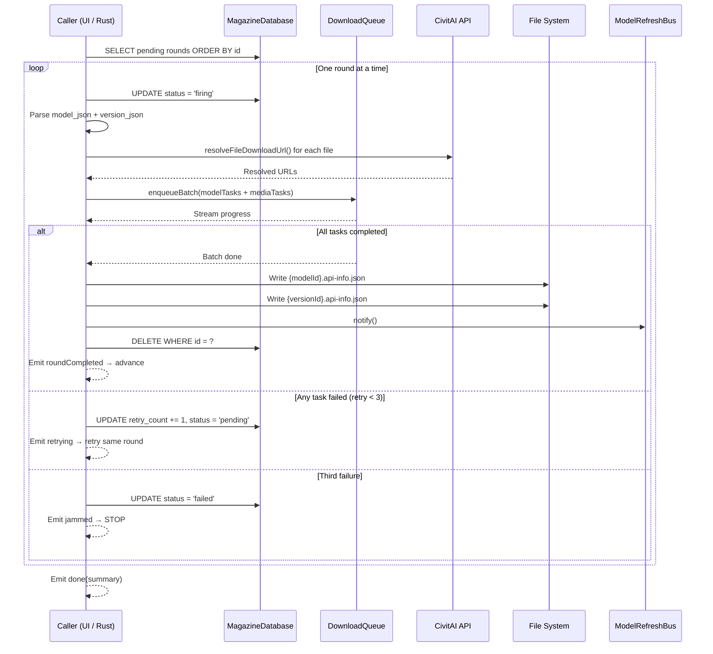

# Magazine Download System Design

> "Load → Review → Fire" — a staging area for model version downloads.
> Each round is a ModelVersion. Load fetches and persists API data. Fire processes rounds one at a time with jam-on-failure semantics.

---

## Design Philosophy

| Principle | Decision |
|-----------|----------|
| **Input** | Single model version ID → Load fetches API data immediately |
| **Review** | Parsed model name, version name, base model, file count, total size — user can remove before firing |
| **Persistence** | `download_magazine` table — survives app restart |
| **Concurrency** | Single round at a time during Fire — no parallel processing |
| **Retry** | Max 3 retries on failure, then **JAM** (stop entirely) |
| **Error handling** | Any exception counts as failure; jam means user must intervene (skip or retry) |
| **Completion** | Successful rounds are **deleted** from the table |
| **JSON files** | Written to disk **after** all downloads finish, as the final step |
| **Relationship to `download_task`** | Magazine is the staging layer; `download_task` is the execution layer — they coexist |
| **Public API** | Both `load()` and `fire()` exposed for external callers (e.g. Rust via `flutter_rust_bridge`) |
| **UI** | Download page gains a Magazine tab; existing Fetch tab is retained as "advanced" option |

---

## Metaphor Mapping

| Metaphor | Implementation |
|----------|----------------|
| **Magazine** | `download_magazine` table — holds all pending/failed/skipped rounds |
| **Load (装弹)** | Call `load(versionId)` → fetch model + version JSON from CivitAI API → store parsed fields + raw JSON in SQLite |
| **Round (子弹)** | One row in the magazine — a model version with its full API data |
| **Fire (扣扳机)** | Call `fire()` → process rounds one at a time, each as a DownloadQueue batch |
| **Jam (卡壳)** | A round fails 3 times → `failed` status, fire stops, user must intervene |
| **Unjam** | User manually skips or retries the failed round, then re-fires |
| **Unload (退弹)** | Remove a pending/skipped round from the magazine |

---

## Architecture Overview

```
┌──────────────────────────────────────────────────┐
│                  download_magazine                │
│  STAGING LAYER — "WHAT to download"              │
│  Unit: ModelVersion (one row = one round)         │
│  Lifecycle: pending → firing → deleted / failed   │
│  Stores: display fields + full API JSON           │
└────────────────────┬─────────────────────────────┘
                     │ Fire creates DownloadTask entries
                     ▼
┌──────────────────────────────────────────────────┐
│                   download_task                   │
│  EXECUTION LAYER — "HOW each file is downloading" │
│  Unit: individual file (many rows per version)    │
│  Lifecycle: pending → downloading → completed     │
│  Managed by: DownloadQueue (unchanged)            │
└──────────────────────────────────────────────────┘
```

These two tables **do not merge**. They serve different granularities:

- Magazine = planning (which versions to download?)
- DownloadTask = execution (what's the progress of each file?)

Magazine **replaces the current "preparation phase"** in `DownloadPage._startDownload()`. The logic of fetching API data, writing JSON files, and building DownloadTask objects moves into the Load + Fire cycle.

---

## Database

### `download_magazine` Table

```sql
CREATE TABLE download_magazine (
  id                INTEGER PRIMARY KEY AUTOINCREMENT,
  model_version_id  INTEGER NOT NULL UNIQUE,
  model_id          INTEGER NOT NULL,
  model_name        TEXT    NOT NULL,
  version_name      TEXT,
  base_model        TEXT,
  model_type        TEXT,
  file_count        INTEGER NOT NULL DEFAULT 0,
  total_size_kb     REAL    NOT NULL DEFAULT 0,
  model_json        TEXT    NOT NULL,       -- GET /api/v1/models/{id}  (full response)
  version_json      TEXT    NOT NULL,       -- GET /api/v1/model-versions/{id} (full response)
  status            TEXT    NOT NULL DEFAULT 'pending',
                    -- 'pending' | 'firing' | 'failed' | 'skipped'
  retry_count       INTEGER NOT NULL DEFAULT 0,
  error_message     TEXT,
  loaded_at         TEXT    NOT NULL,
  fired_at          TEXT
);

CREATE INDEX idx_magazine_status ON download_magazine(status);
```

### Column Rationale

| Column | Purpose |
|--------|---------|
| `model_version_id` | Primary identifier; UNIQUE prevents duplicate loads |
| `model_id` | FK-like reference to the parent model |
| `model_name` | Parsed display field — user sees this before firing |
| `version_name` | Parsed display field — user confirms the right version |
| `base_model` | e.g. "SD 1.5", "SDXL 1.0" — display only |
| `model_type` | e.g. "Checkpoint", "LoRA" — used to build file paths |
| `file_count` | Number of files in this version (model + media) — display |
| `total_size_kb` | Sum of all file sizes — display |
| `model_json` | Full `GET /api/v1/models/{id}` response as JSON string |
| `version_json` | Full `GET /api/v1/model-versions/{id}` response as JSON string |
| `status` | Current state in the magazine lifecycle |
| `retry_count` | How many consecutive failures for this round (0–3) |
| `error_message` | Last error that caused failure |
| `fired_at` | Timestamp of most recent Fire attempt on this round |

### State Machine

```txt
                    Load (API fetch + validate + INSERT)
                               │
                          ┌────▼────┐
                          │ pending  │◄─────────── unjam(retry): reset retry_count to 0
                          └────┬────┘
                               │ Fire picks this round
                          ┌────▼────┐
                          │ firing   │ ← AT MOST ONE row has this at any time
                          └────┬────┘
                               │
                    ┌──────────┼──────────┐
                    │          │          │
                success    failure    failure
                    │     (retry<3)  (retry=3)
                    │          │          │
                    │     ┌────▼────┐     │
                    │     │ pending │     │  ← auto-retry: increment retry_count, reset to pending
                    │     └─────────┘     │
                    │                ┌────▼────┐
                    │                │  failed  │ ← JAM — Fire loop stops entirely
                    │                └────┬────┘
                    │               unjam│ unjam
                    │              (skip)│ (retry)
                    │               ┌────▼───┐ │
                    │               │skipped  │ │
                    │               └─────────┘ │
                    │                    └──────┘
               ┌────▼────┐
               │ DELETED  │ ← row removed from table
               └──────────┘   auto-advance to next pending
```

### Crash Recovery

On app restart, `init()` checks the magazine table:

1. Find any row with `status = 'firing'` (can only be one)
2. Reset it: `status = 'pending'` (preserve `retry_count` so a round that had 2 failures doesn't get a fresh 3 attempts)
3. Delete any `download_task` entries whose `model_version_id` matches that round (they are orphaned from the crashed session)
4. Magazine is now in a consistent state — ready for Fire or manual intervention

Without the `firing` status, recovery would require cross-referencing `download_task` batches with magazine rows — brittle and unnecessary.

---

## Data Model

### `MagazineItem`

```dart
class MagazineItem {
  final int id;                    // SQLite auto-increment PK
  final int modelVersionId;        // CivitAI model version ID
  final int modelId;               // Parent model ID
  final String modelName;          // Display name from API
  final String? versionName;       // Version name from API (nullable)
  final String? baseModel;         // e.g. "SD 1.5", "SDXL 1.0"
  final String? modelType;         // e.g. "Checkpoint", "LoRA"
  final int fileCount;             // Total downloadable files
  final double totalSizeKb;        // Sum of all file sizes
  final String modelJson;          // Full API response JSON
  final String versionJson;        // Full API response JSON
  final MagazineItemStatus status;
  final int retryCount;
  final String? errorMessage;
  final DateTime loadedAt;
  final DateTime? firedAt;

  const MagazineItem({ /* ... */ });

  factory MagazineItem.fromRow(Map<String, Object?> row);
  Map<String, Object?> toRow();
}

enum MagazineItemStatus {
  pending,   // Waiting to be fired
  firing,    // Currently being processed (only one at a time)
  failed,    // JAMMED — failed after 3 retries
  skipped,   // User chose to skip
}
```

### `LoadResult` — Returned by `load()`

```dart
/// Result of loading a round into the magazine.
sealed class LoadResult {
  /// Successfully loaded and persisted.
  const factory LoadResult.ok(MagazineItem item) = LoadOk;

  /// Validation or API error with structured details.
  const factory LoadResult.error(LoadError error) = LoadError_;
}

class LoadError {
  final LoadErrorType type;
  final String message;    // Human-readable, safe for UI display
  final String? detail;    // Technical detail for logging

  const LoadError({required this.type, required this.message, this.detail});
}

enum LoadErrorType {
  invalidId,            // Not a positive integer
  networkError,         // Connection failed, timeout
  apiError,             // API returned non-200 (404, 403, etc.)
  validationError,      // API response missing required fields
  alreadyInMagazine,    // Duplicate model_version_id
}
```

### `FireEvent` — Streamed by `fire()`

```dart
/// Events emitted during the Fire process.
sealed class FireEvent {
  /// A round has started processing.
  const factory FireEvent.roundStarted(MagazineItem item) = FireRoundStarted;

  /// Retrying a failed round (attempt 2 or 3).
  const factory FireEvent.retrying(MagazineItem item, int attempt, String reason) = FireRetrying;

  /// A round downloaded successfully and was removed from the magazine.
  const factory FireEvent.roundCompleted(int modelVersionId, String modelName) = FireRoundCompleted;

  /// A round was skipped by user unjam action.
  const factory FireEvent.roundSkipped(MagazineItem item) = FireRoundSkipped;

  /// Fire is complete — all pending rounds processed or magazine is empty.
  const factory FireEvent.done(FireSummary summary) = FireDone;

  /// MAGAZINE JAMMED — a round failed 3 times. User must intervene.
  const factory FireEvent.jammed(MagazineItem failedItem) = FireJammed;
}

class FireSummary {
  final int completed;
  final int skipped;
  final int failed;

  const FireSummary({
    required this.completed,
    required this.skipped,
    required this.failed,
  });
}
```

---

## Public API

Both `load()` and `fire()` are public, top-level or singleton methods designed for FFI access from Rust via `flutter_rust_bridge`.

```dart
/// Public API — add a model version to the magazine.
///
/// Fetches model + version data from CivitAI, validates the response,
/// parses display fields, and persists to [DownloadMagazineDatabase].
///
/// Returns [LoadResult.ok] with the created [MagazineItem],
/// or [LoadResult.error] with structured error details.
///
/// Callable from Rust via flutter_rust_bridge.
Future<LoadResult> load({
  required int modelVersionId,
  required CivitaiApiClient api,
}) async { /* ... */ }

/// Public API — fire the magazine, processing rounds one at a time.
///
/// Each round is processed sequentially:
///   1. Mark status = 'firing'
///   2. Read model_json + version_json from the magazine row
///   3. Build DownloadTask objects (model files, media files)
///   4. Enqueue to DownloadQueue
///   5. Wait for all tasks in the batch to complete
///   6. On success: write API JSON files to disk, DELETE the magazine row
///   7. Auto-advance to next pending round
///
/// On failure (any exception):
///   - If retry_count < 2: increment, reset to 'pending', retry automatically
///   - If retry_count >= 2 (3rd failure): mark 'failed', emit [FireEvent.jammed], STOP
///
/// Returns a [Stream] of [FireEvent] for real-time progress.
///
/// Callable from Rust via flutter_rust_bridge.
Stream<FireEvent> fire({
  required DownloadMagazineDatabase magazineDb,
  required CivitaiApiClient api,
}) async* { /* ... */ }
```

---

## Load Flow

```
load(versionId)
  │
  ├─ Validate: versionId > 0 (integer)
  │   └─ Fail → LoadError(type: invalidId)
  │
  ├─ Check duplicate: SELECT FROM download_magazine WHERE model_version_id = ?
  │   └─ Exists → LoadError(type: alreadyInMagazine)
  │
  ├─ API call: GET /api/v1/model-versions/{versionId}
  │   ├─ Network error → LoadError(type: networkError)
  │   ├─ HTTP 4xx/5xx → LoadError(type: apiError)
  │   └─ Success → parse ModelVersionEndpointData
  │
  ├─ Validate version response:
  │   ├─ id != null
  │   ├─ modelId != null
  │   ├─ files[] is non-empty (at least one downloadable file)
  │   └─ Fail → LoadError(type: validationError, detail: "missing required field: ...")
  │
  ├─ API call: GET /api/v1/models/{modelId}
  │   ├─ Network error → LoadError(type: networkError)
  │   ├─ HTTP 4xx/5xx → LoadError(type: apiError)
  │   └─ Success → parse Model data
  │
  ├─ Validate model response:
  │   ├─ id != null
  │   ├─ name != null
  │   └─ Fail → LoadError(type: validationError)
  │
  ├─ Parse display fields:
  │   ├─ modelName = model.name
  │   ├─ versionName = version.name
  │   ├─ baseModel = version.baseModel
  │   ├─ modelType = model.type
  │   ├─ fileCount = count of model files + media images
  │   └─ totalSizeKb = sum of file sizes
  │
  ├─ Serialize: model_json = jsonEncode(model), version_json = jsonEncode(version)
  │
  └─ INSERT INTO download_magazine
      → LoadResult.ok(MagazineItem)
```

### Validation Details

| Check | Error `type` | Example `message` |
|-------|-------------|-------------------|
| `versionId` ≤ 0 or non-integer | `invalidId` | "Model version ID must be a positive integer" |
| Already in magazine | `alreadyInMagazine` | "Version 123456 is already in the magazine" |
| No network connection | `networkError` | "Network error: Connection refused" |
| HTTP 404 | `apiError` | "API error (404): Model version not found. Check the ID or your API key for NSFW content." |
| HTTP 403 | `apiError` | "API error (403): Access denied. Check your API key." |
| HTTP 5xx | `apiError` | "API error (500): CivitAI server error. Try again later." |
| Version response missing `modelId` | `validationError` | "Invalid API response: missing required field 'modelId' in version data" |
| Version has no files | `validationError` | "Version 123456 has no downloadable files" |
| Model response missing `name` | `validationError` | "Invalid API response: missing required field 'name' in model data" |

---

## Fire Flow

```
fire()
  │
  ├─ Load all pending rounds: SELECT * WHERE status = 'pending' ORDER BY id
  ├─ If none → emit FireEvent.done(summary: all zeros)
  │
  └─ For each pending round (sequential):
       │
       ├─ Emit FireEvent.roundStarted(item)
       ├─ UPDATE status = 'firing', fired_at = now
       │
       ├─ Read model_json, version_json from magazine row
       ├─ Parse into Model and ModelVersion objects
       │
       ├─ Resolve file download URLs (embed auth token)
       │   └─ Any failure → count as retry
       │
       ├─ Build DownloadTask list:
       │   ├─ modelTasks: one per "Model" type file
       │   └─ mediaTasks: one per image
       │   (Note: no apiJsonTasks here — JSON files written at the end)
       │
       ├─ Enqueue to DownloadQueue.instance.enqueueBatch()
       │
       ├─ Wait for batch completion (listen to DownloadQueue.stateStream)
       │   │
       │   ├─ All tasks completed → SUCCESS
       │   │   ├─ Write {modelId}.api-info.json to disk
       │   │   ├─ Write {versionId}.api-info.json to disk
       │   │   ├─ Upsert to local DB (ModelRepository + ModelVersionRepository)
       │   │   ├─ DELETE FROM download_magazine WHERE id = ?
       │   │   ├─ Notify ModelRefreshBus
       │   │   └─ Emit FireEvent.roundCompleted(versionId, modelName)
       │   │
       │   └─ Any task failed → count as FAILURE (one retry)
       │
       └─ On failure:
            ├─ retry_count += 1
            ├─ UPDATE download_magazine SET retry_count = ?, error_message = ?
            │
            ├─ If retry_count < 3:
            │   ├─ UPDATE status = 'pending'
            │   ├─ Emit FireEvent.retrying(item, retry_count + 1, errorMessage)
            │   └─ GOTO top of loop for THIS SAME ROUND (retry)
            │
            └─ If retry_count >= 3:
                ├─ UPDATE status = 'failed'
                ├─ Emit FireEvent.jammed(item)
                └─ STOP — do NOT continue to next round
```

### Fire Sequence Diagram



---

## Unjam Actions

When the magazine is jammed (`status = 'failed'` on any round):

| Action | Method | Effect |
|--------|--------|--------|
| **Skip** | `skipFailedRound(id)` | UPDATE status = 'skipped'. User re-fires → continues from next pending. |
| **Retry** | `retryFailedRound(id)` | UPDATE status = 'pending', retry_count = 0. User re-fires → retries this round. |

Both are simple database operations. The user then calls `fire()` again to resume.

```dart
/// Skip a jammed round — mark it as skipped so Fire can continue.
Future<void> skipFailedRound(int magazineId);

/// Retry a jammed round — reset to pending with fresh retry count.
Future<void> retryFailedRound(int magazineId);
```

---

## Magazine Database CRUD

```dart
class DownloadMagazineDatabase {
  const DownloadMagazineDatabase();

  /// Load: add a model version to the magazine.
  /// Performs duplicate check. Does NOT fetch API data (caller handles that).
  Future<void> insert(MagazineItem item);

  /// Unload: remove a round from the magazine.
  /// Only allowed for 'pending', 'skipped', or 'failed' statuses.
  Future<void> remove(int id);

  /// Clear all non-firing rounds.
  Future<void> clear();

  /// Get all rounds (ordered by insertion).
  Future<List<MagazineItem>> loadAll();

  /// Get all pending rounds (ordered by insertion).
  Future<List<MagazineItem>> loadPending();

  /// Get the currently firing round (at most one).
  Future<MagazineItem?> loadFiring();

  /// Update a round's status, retry_count, error_message.
  Future<void> update(MagazineItem item);

  /// Find by model_version_id for duplicate check.
  Future<MagazineItem?> findByModelVersionId(int modelVersionId);

  /// Crash recovery: find any leftover 'firing' round.
  Future<MagazineItem?> findFiringRound();

  /// Crash recovery: reset 'firing' round back to 'pending'.
  Future<void> resetFiringToPending(int id);

  /// Delete a round (called on successful completion).
  Future<void> delete(int id);
}
```

---

## Deduplication Strategy

Three layers of dedup, checked at different stages:

| Layer | When | Check | Action |
|-------|------|-------|--------|
| **1. Magazine internal** | Load | `model_version_id` UNIQUE in `download_magazine` | Reject with `alreadyInMagazine` |
| **2. Active queue** | Fire | `DownloadQueue` has active batch for this `model_version_id` | Skip this round (shouldn't happen in normal flow, but guards against race conditions) |
| **3. Disk** | Fire | `{basePath}/{modelType}/{modelId}/{versionId}/` directory exists with JSON files | Skip this round — already downloaded |

---

## UI Design

### Download Page Layout

```txt
┌─────────────────────────────────────┐
│  Download                       [⚙] │
├─────────────────────────────────────┤
│  [ Fetch ]  [ Magazine ]            │  ← TabBar
├─────────────────────────────────────┤
│                                     │
│  (TabBarView content area)          │
│                                     │
├─────────────────────────────────────┤
│  === Download Queue (shared) ===    │  ← Always visible, both tabs
│  ┌───────────────────────────────┐  │
│  │ Batch Card 1                  │  │
│  │ Batch Card 2                  │  │
│  └───────────────────────────────┘  │
└─────────────────────────────────────┘
```

### Magazine Tab Layout

```txt
┌─────────────────────────────────────────┐
│  ┌────────────────────────────┐  [Load]  │  ← Input + button
│  │ model version ID (integer)  │          │
│  └────────────────────────────┘          │
├─────────────────────────────────────────┤
│  Magazine (3)         [Unload All] [Fire]│  ← Header: count + actions
├─────────────────────────────────────────┤
│  ┌─────────────────────────────────────┐│
│  │ ⬜ SDXL Model Name — v2.0            ││  ← pending (grey)
│  │   Checkpoint · 2 files · 6.8 GB     ││
│  │                            [✕]      ││  ← unload button
│  └─────────────────────────────────────┘│
│  ┌─────────────────────────────────────┐│
│  │ ⬜ LoRA Name — v1.0                  ││  ← pending
│  │   LoRA · 1 file · 144 MB            ││
│  │                            [✕]      ││
│  └─────────────────────────────────────┘│
│  ┌─────────────────────────────────────┐│
│  │ ❌ Bad Model — v3.0                  ││  ← failed (red)
│  │   Error: API 503 — server overload   ││
│  │              [Skip] [Retry]          ││  ← unjam actions
│  └─────────────────────────────────────┘│
│  ┌─────────────────────────────────────┐│
│  │ ⏭️ Skipped Model — v1.0              ││  ← skipped (yellow)
│  │   User skipped                      ││
│  └─────────────────────────────────────┘│
├─────────────────────────────────────────┤
│  Fire: ✅ 2 done · ❌ 1 jammed           │  ← Status bar (during/after Fire)
└─────────────────────────────────────────┘
```

### Status Display

| Status | Icon | Color | Subtitle |
|--------|------|-------|----------|
| `pending` | `Icons.radio_button_unchecked` | `secondary` | model type · file count · total size |
| `firing` | `Icons.hourglass_top` + spinner | `primary` | "Downloading files…" |
| `failed` | `Icons.error` | `error` | error message + [Skip] [Retry] buttons |
| `skipped` | `Icons.skip_next` | `warning` | "Skipped" |

There is no "completed" row — successful rounds are deleted immediately.

### Button Behavior

| Button | State | Action |
|--------|-------|--------|
| **Load** | Input empty or invalid | Disabled |
| **Load** | Valid ID entered | Validate → API fetch → INSERT → clear input |
| **Fire** | Magazine empty or isFiring | Disabled |
| **Fire** | Pending rounds exist, not firing | Begin sequential Fire loop |
| **Fire** | Jammed (has failed round) | Disabled — user must unjam first |
| **Unload All** | Any non-firing rounds exist | Confirmation dialog → DELETE non-firing rows |
| **[✕] (unload)** | Round is pending/skipped/failed | DELETE single row |

---

## Edge Cases

| Case | Handling |
|------|----------|
| Input non-integer | Button disabled; hint text "Enter a numeric version ID" |
| Input already in magazine | SnackBar "Version 123456 is already in the magazine" |
| Magazine empty, press Fire | Button disabled |
| Fire in progress, press Fire again | Ignored (button disabled / isFiring guard) |
| Fire in progress, switch to Fetch tab | Allowed — Fire is independent of widget lifecycle |
| Fire in progress, leave Download page | Fire continues (not bound to widget tree) |
| App killed during Fire | On restart: `firing` row reset to `pending`, orphaned `download_task` entries deleted |
| App killed during Fire, download partially complete | Resumed tasks will re-download (idempotent — existing files overwritten or skipped based on DownloadQueue behavior) |
| API returns version but model endpoint fails | Load fails with `apiError` or `validationError` |
| Version has images but no model file | Still loadable; Fire creates only media tasks |
| Duplicate Fire (race condition) | `isFiring` flag in magazine database prevents concurrent Fire calls |
| All rounds completed | Magazine table is empty; Fire emits `done(0,0,0)` |
| Multiple jammed rounds (impossible in normal flow) | Only the first `failed` round blocks Fire; user must clear it before others matter |

---

## File Structure

```txt
lib/
├── services/
│   └── download/
│       ├── download_task.dart                  — (existing) DownloadTask, DownloadQueueState
│       ├── download_database.dart              — (existing) download_task table CRUD
│       ├── download_queue.dart                 — (existing) queue engine (unchanged)
│       ├── download_magazine_item.dart         — (new) MagazineItem model + MagazineItemStatus enum
│       ├── download_magazine_database.dart     — (new) download_magazine table CRUD + migration
│       └── download_magazine_resolver.dart     — (new) Load + Fire engine (public API)
└── ui/
    └── download/
        ├── download_page.dart                  — (modify) add TabBar, integrate Magazine tab
        ├── download_fetch_tab.dart             — (refactor) extract existing Fetch logic
        ├── download_magazine_tab.dart          — (new) Magazine tab UI
        └── widgets/
            ├── download_batch_card.dart        — (existing)
            ├── download_task_tile.dart         — (existing)
            └── magazine_item_tile.dart         — (new) single round row component
```

---

## Implementation Steps

| Step | File | Description |
|------|------|-------------|
| 1 | `download_magazine_item.dart` | `MagazineItem` model, `MagazineItemStatus` enum, `LoadResult`, `LoadError`, `FireEvent`, `FireSummary` |
| 2 | `download_magazine_database.dart` | `download_magazine` table migration + CRUD |
| 3 | `download_magazine_resolver.dart` | `load()` + `fire()` public API with validation, retry, and jam logic |
| 4 | `download_fetch_tab.dart` | Extract existing Fetch logic into standalone widget (refactor only) |
| 5 | `magazine_item_tile.dart` | Single round row: status icon, parsed info, unload/unjam buttons |
| 6 | `download_magazine_tab.dart` | Magazine tab: input + Load button, round list, Fire button, status bar |
| 7 | `download_page.dart` | Add TabBar, integrate both tabs, shared queue section |
| 8 | `database.dart` | Add `download_magazine` to migration |
