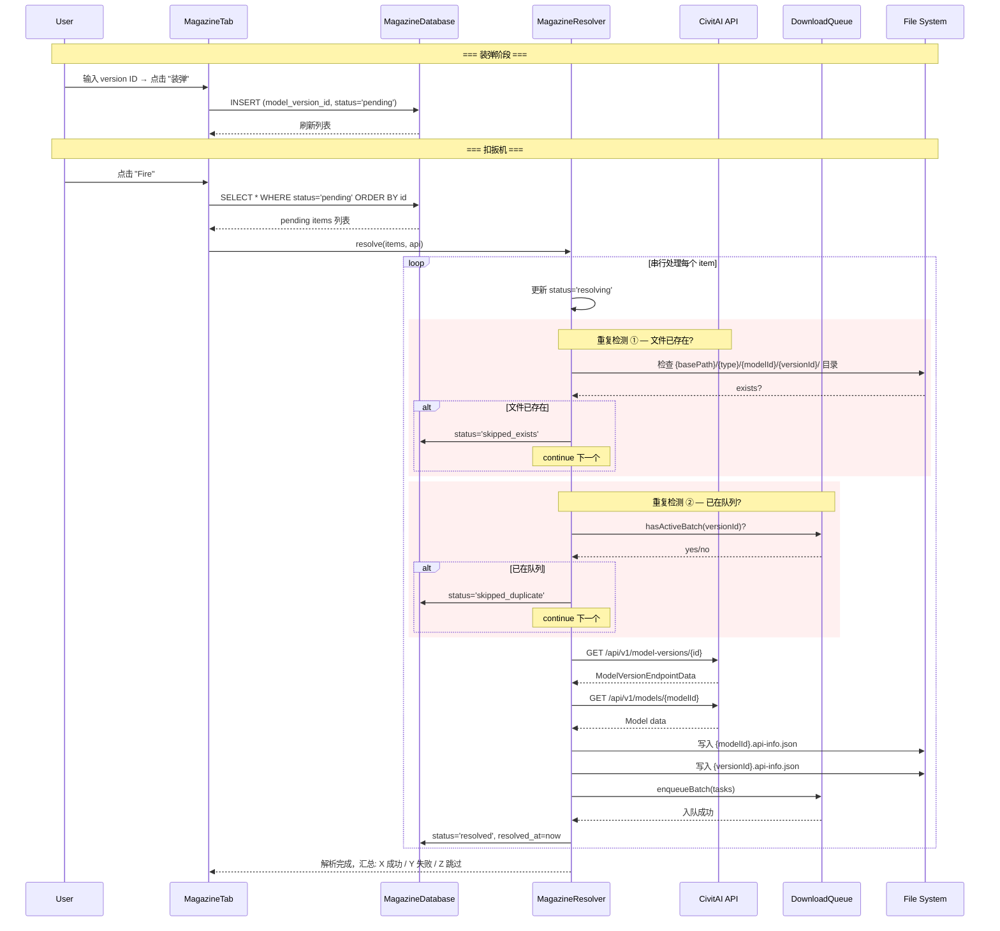

# Magazine Download System Design

> "装弹-扣扳机" 批量下载模式 — 逐个收集 model version ID，一次性串行解析并入队。

---

## 设计哲学

| 原则 | 决策 |
|------|------|
| **输入** | 逐个添加（一个输入框 + "装弹"按钮），不是文本框粘贴 |
| **持久化** | `download_magazine` 表 — app 重启不丢失 |
| **解析** | 串行 — 一个接一个，可看到每个 version 的实时状态 |
| **进度** | 仅显示 "解析中 3/15" + 每个 item 的状态 |
| **错误** | Skip & Continue — 失败跳过，继续下一个，最后汇总 |
| **重复检测** | 已下载 → 跳过 / 已在队列 → 跳过 / 弹匣内去重 |
| **UI** | Download 页面新增 Tab（Fetch + Magazine） |

---

## 隐喻映射

| 隐喻 | 实现 |
|------|------|
| **弹匣 (Magazine)** | `download_magazine` 表，存储待处理的 version ID 列表 |
| **装弹 (Load)** | 用户在输入框输入一个 version ID，点击 "装弹" 按钮，添加到弹匣 |
| **子弹 (Round)** | 弹匣中的一行 — 一个待解析的 model version ID |
| **扣扳机 (Fire)** | 点击 "Fire" 按钮，串行解析弹匣中所有 pending 项 |
| **退弹 (Unload)** | 从弹匣中移除某个未处理的 item |
| **清空弹匣 (Clear)** | 一键清空所有 pending / 已完成 item |

---

## 数据库

### `download_magazine` 表

```sql
CREATE TABLE download_magazine (
  id                INTEGER PRIMARY KEY AUTOINCREMENT,
  model_version_id  INTEGER NOT NULL UNIQUE,
  status            TEXT    NOT NULL DEFAULT 'pending',
                    -- 'pending' | 'resolving' | 'resolved' | 'skipped_duplicate' | 'skipped_exists' | 'failed'
  error_message     TEXT,
  created_at        TEXT    NOT NULL,
  resolved_at       TEXT
);

CREATE INDEX idx_magazine_status ON download_magazine(status);
```

### 状态机

```txt
                       +---------+
          装弹 ───────→| pending |
                       +----+----+
                            | Fire 开始
                       +----v-----+
                       | resolving |
                       +----+-----+
                            |
          ┌─────────┬───────┼──────────┬──────────┐
          │         │       │          │          │
     +----v---+ +---v----+ +v--------+ +v------+ |
     |resolved| |failed  | |skipped_  | |skipped| |
     +--------+ +--------+ |duplicate | |_exists| |
                           +----------+ +-------+ |
                                                  |
                     Fire 全部完成后汇总           |
```

### 与 `download_task` 表的关系

- Magazine 不直接关联 `download_task`
- 解析成功时，调用现有的 `DownloadQueue.enqueueBatch()` 创建 `download_task` 行
- 重复检测通过查询 `download_task` 表实现（不新增 FK）

---

## 架构

```txt
lib/
├── services/
│   └── download/
│       ├── download_task.dart                  — (已有) DownloadTask, DownloadQueueState
│       ├── download_database.dart              — (已有) download_task 表 CRUD
│       ├── download_queue.dart                 — (已有) 队列引擎
│       ├── download_magazine_database.dart     — (新增) download_magazine 表 CRUD
│       ├── download_magazine_item.dart         — (新增) MagazineItem 数据模型
│       └── download_magazine_resolver.dart     — (新增) 串行解析引擎
└── ui/
    └── download/
        ├── download_page.dart                  — (修改) 新增 TabBar
        ├── download_fetch_tab.dart             — (重构) 现有 Fetch 逻辑提取为独立 tab
        ├── download_magazine_tab.dart          — (新增) Magazine tab 完整 UI
        └── widgets/
            ├── download_batch_card.dart        — (已有)
            ├── download_task_tile.dart         — (已有)
            └── magazine_item_tile.dart         — (新增) 弹匣单行组件
```

---

## 数据模型

### `MagazineItem`

```dart
/// 弹匣中的一行 — 一个待解析的 model version ID。
class MagazineItem {
  final int id;                   // SQLite 自增主键
  final int modelVersionId;       // CivitAI model version ID
  MagazineItemStatus status;      // 当前状态
  String? errorMessage;
  final DateTime createdAt;
  DateTime? resolvedAt;

  // ... fromRow / toRow 工厂方法
}

enum MagazineItemStatus {
  pending,           // 等待解析
  resolving,         // 正在解析
  resolved,          // 解析成功，已入队
  skippedDuplicate,  // 跳过 — 已在下载队列中
  skippedExists,     // 跳过 — 文件已存在
  failed,            // 解析失败（API 错误等）
}
```

### `MagazineState`（UI 绑定）

```dart
/// Magazine tab 的完整 UI 状态。
class MagazineState {
  final List<MagazineItem> items;
  final bool isFiring;           // 正在扣扳机
  final int resolvedCount;       // 成功数
  final int failedCount;         // 失败数
  final int skippedCount;        // 跳过数

  int get pendingCount =>
      items.where((i) => i.status == MagazineItemStatus.pending).length;
  int get totalCount => items.length;
}
```

---

## 数据流



---

## Magazine Resolver 逻辑

### 核心方法

```dart
class DownloadMagazineResolver {
  /// 串行解析弹匣中所有 pending item。
  ///
  /// 每个 item 独立处理：成功 → resolved，失败 → failed + skip。
  /// 通过 [onItemUpdate] 回调实时推送每个 item 的状态变更。
  Future<MagazineResult> resolve({
    required CivitaiApi api,
    required List<MagazineItem> items,
    required void Function(MagazineItem item) onItemUpdate,
  });
}

/// 解析结果汇总。
class MagazineResult {
  final int resolved;
  final int failed;
  final int skippedDuplicate;
  final int skippedExists;
}
```

### 单个 item 解析步骤

```dart
Future<void> _resolveOne(MagazineItem item) async {
  // 1. 标记 resolving
  item.status = MagazineItemStatus.resolving;

  // 2. 重复检测 ①：文件是否已存在
  final basePath = await FileLayout.basePath;
  final exists = await _checkFilesExist(basePath, item.modelVersionId);
  if (exists) {
    item.status = MagazineItemStatus.skippedExists;
    return;
  }

  // 3. 重复检测 ②：是否已在下载队列
  final inQueue = await _db.hasActiveBatch(item.modelVersionId);
  if (inQueue) {
    item.status = MagazineItemStatus.skippedDuplicate;
    return;
  }

  // 4. API 调用：获取 version 详情
  final versionResult = await api.modelVersions.getById(item.modelVersionId);
  if (versionResult.isLeft) {
    item.status = MagazineItemStatus.failed;
    item.errorMessage = _formatError(versionResult.left);
    return;
  }
  final version = versionResult.right;

  // 5. API 调用：获取 model 信息
  final modelResult = await api.models.getById(version.modelId);
  if (modelResult.isLeft) {
    item.status = MagazineItemStatus.failed;
    item.errorMessage = _formatError(modelResult.left);
    return;
  }
  final model = modelResult.right;

  // 6. 写入 API JSON 到磁盘
  await _writeApiJson(basePath, model, version);

  // 7. 构建 DownloadTask 列表并入队
  final tasks = _buildDownloadTasks(model, version);
  await DownloadQueue.instance.enqueueBatch(
    batchId: tasks.first.batchId,
    apiJsonTasks: tasks.where((t) => t.fileType == DownloadFileType.apiJson).toList(),
    modelTasks: tasks.where((t) => t.fileType == DownloadFileType.model).toList(),
    mediaTasks: tasks.where((t) => t.fileType == DownloadFileType.media).toList(),
  );

  // 8. 标记 resolved
  item.status = MagazineItemStatus.resolved;
  item.resolvedAt = DateTime.now();
}
```

### 重复检测逻辑

```dart
/// 检查 version 的文件是否已在磁盘上。
Future<bool> _checkFilesExist(String basePath, int versionId) async {
  // 需要先知道 modelId 和 modelType
  // 方法 A: 查询本地 SQLite model_version 表
  // 方法 B: 直接扫描文件系统（当前 download_queue 的做法）
  // 采用方法 A — 更快，不需要知道目录结构
  final versions = await _localDb.getModelVersionsById(versionId);
  if (versions.isEmpty) return false;
  // 有本地记录 = 曾经下载过，检查关键文件是否存在
  final dir = Directory(p.join(basePath, versions.first.modelType,
      '${versions.first.modelId}', '$versionId'));
  return await dir.exists();
}
```

---

## Magazine Database CRUD

```dart
class DownloadMagazineDatabase {
  const DownloadMagazineDatabase();

  /// 装弹：添加一个 version ID 到弹匣。
  /// 返回 null 表示成功，返回 String 表示失败原因。
  Future<String?> add(int modelVersionId) async { /* ... */ }

  /// 退弹：从弹匣中移除指定 item。
  Future<void> remove(int id) async { /* ... */ }

  /// 清空弹匣：删除所有非 resolving 状态的 item。
  Future<void> clear() async { /* ... */ }

  /// 获取所有 item（按添加顺序）。
  Future<List<MagazineItem>> loadAll() async { /* ... */ }

  /// 获取所有 pending item。
  Future<List<MagazineItem>> loadPending() async { /* ... */ }

  /// 更新单个 item 的状态。
  Future<void> update(MagazineItem item) async { /* ... */ }
}
```

### 去重逻辑（装弹时）

```dart
Future<String?> add(int modelVersionId) async {
  // 检查弹匣内是否已存在
  final existing = await _db.query(
    'download_magazine',
    where: 'model_version_id = ?',
    whereArgs: [modelVersionId],
  );
  if (existing.isNotEmpty) {
    return '已在弹匣中';
  }
  // 插入
  await _db.insert('download_magazine', { /* ... */ });
  return null; // 成功
}
```

---

## UI 设计

### Download 页面布局

```txt
┌─────────────────────────────────┐
│  Download                   [⚙] │
├─────────────────────────────────┤
│  [ Fetch ]  [ Magazine ]        │  ← TabBar
├─────────────────────────────────┤
│                                 │
│  (TabBarView 内容区域)           │
│                                 │
├─────────────────────────────────┤
│  === 下载队列 (两个 Tab 共享) === │  ← 底部队列区域始终可见
│  ┌───────────────────────────┐  │
│  │ Batch Card 1              │  │
│  │ Batch Card 2              │  │
│  └───────────────────────────┘  │
└─────────────────────────────────┘
```

### Magazine Tab 布局

```txt
┌─────────────────────────────────┐
│  ┌──────────────────────┐ [装弹] │  ← 输入框 + 按钮
│  │ version ID (数字)     │       │
│  └──────────────────────┘       │
├─────────────────────────────────┤
│  弹匣 (3)           [清空] [Fire]│  ← 头部：计数 + 操作按钮
├─────────────────────────────────┤
│  ┌─────────────────────────────┐│
│  │ ✅ 123456  v1.0 ModelName   ││  ← resolved (绿色)
│  └─────────────────────────────┘│
│  ┌─────────────────────────────┐│
│  │ ⏳ 789012  (解析中…)        ││  ← resolving (蓝色 + spinner)
│  └─────────────────────────────┘│
│  ┌─────────────────────────────┐│
│  │ ⬜ 345678                    ││  ← pending (灰色)
│  │            [✕]              ││  ← 退弹按钮
│  └─────────────────────────────┘│
│  ┌─────────────────────────────┐│
│  │ ❌ 901234  Not found        ││  ← failed (红色 + 错误信息)
│  └─────────────────────────────┘│
│  ┌─────────────────────────────┐│
│  │ ⏭️ 567890  文件已存在       ││  ← skipped (黄色)
│  └─────────────────────────────┘│
│  ┌─────────────────────────────┐│
│  │ ⏭️ 111111  已在下载队列     ││  ← skipped (黄色)
│  └─────────────────────────────┘│
├─────────────────────────────────┤
│  解析中 2/6                      │  ← 底部进度条（Fire 时显示）
│  ████████░░░░░░░░               │
└─────────────────────────────────┘
```

### 状态图标映射

| Status | 图标 | 颜色 |
|--------|------|------|
| `pending` | `⬜` `Icons.radio_button_unchecked` | `secondary` |
| `resolving` | `⏳` `Icons.hourglass_top` + spinner | `primary` |
| `resolved` | `✅` `Icons.check_circle` | `accent` |
| `failed` | `❌` `Icons.error` | `error` |
| `skipped_duplicate` | `⏭️` `Icons.skip_next` | `warning` |
| `skipped_exists` | `⏭️` `Icons.skip_next` | `warning` |

### Magazine Item 信息展示

| 状态 | 显示内容 |
|------|---------|
| `pending` | version ID |
| `resolving` | version ID + spinner |
| `resolved` | version ID + model name + version name |
| `failed` | version ID + 错误信息 |
| `skipped_*` | version ID + 跳过原因 |

---

## 按键行为

### 装弹 (Load)

1. 校验输入是否为有效正整数
2. 查询 `download_magazine` 表是否已存在该 ID
3. 不存在 → INSERT，清空输入框，列表刷新
4. 已存在 → 显示 snackbar "已在弹匣中"，不清空输入框

### 扣扳机 (Fire)

1. 加载所有 `pending` item
2. 将按钮切换为 "停止" / 禁用态
3. 启动 `MagazineResolver.resolve()`
4. 每个 item 状态变更时，通过 `onItemUpdate` 回调实时刷新 UI
5. 全部完成后，按钮恢复，显示 SnackBar 汇总：
   > "解析完成 — 12 成功, 2 失败, 1 跳过"
6. 自动清除 resolved 和 skipped 的 item？→ **不自动清除**，用户可以手动清空

### 停止 (Stop) — Fire 过程中

1. 设置取消标志
2. 当前正在解析的 item 完成后不再继续下一个
3. 剩余的 pending item 保持 pending 状态

### 退弹 (Unload)

1. 从 `download_magazine` 表中 DELETE
2. 只能退 `pending` / `failed` / `skipped_*` 状态的 item
3. `resolved` 状态的 item 退弹无意义（已入队），但允许删除记录

### 清空 (Clear)

1. 二次确认对话框
2. DELETE 所有非 `resolving` 状态的 item
3. `resolving` 状态的 item 保留（正在 Fire 中）

---

## 边界情况

| 情况 | 处理 |
|------|------|
| 输入非数字 | 按钮 disabled / 显示 "请输入数字 ID" |
| 输入已存在的 ID（弹匣内） | snackbar "已在弹匣中" |
| 弹匣为空时点 Fire | 按钮 disabled |
| Fire 中再次点 Fire | 忽略（按钮已 disabled） |
| Fire 中切换到 Fetch tab | 允许 — 解析继续在后台运行，回来后状态仍更新 |
| Fire 中退出 Download 页面 | 解析继续（Resolver 不绑定 widget lifecycle） |
| App 在 Fire 中被 kill | 重启后，`resolving` 状态的 item 重置为 `pending`，`pending` 保持不变。下次 Fire 继续解析 |
| API 返回 `modelId` 但 model 不存在 | 写入 version JSON，model JSON 标记 failed，继续下一个 |
| version 没有 model file（只有 metadata） | 只创建 apiJson + media 任务 |
| 同一个 version 入队两次（竞态） | `DownloadQueue` 已有的 duplicate enqueue 逻辑处理 |

---

## 实现步骤

| 步骤 | 文件 | 描述 |
|------|------|------|
| 1 | `download_magazine_item.dart` | `MagazineItem` 数据模型 + `MagazineItemStatus` 枚举 |
| 2 | `download_magazine_database.dart` | `download_magazine` 表 CRUD + 建表 migration |
| 3 | `download_magazine_resolver.dart` | 串行解析引擎，Skip & Continue |
| 4 | `magazine_item_tile.dart` | 弹匣单行 UI 组件（状态图标 + 信息 + 退弹按钮） |
| 5 | `download_fetch_tab.dart` | 提取现有 Fetch 逻辑为独立 tab（纯重构，不改行为） |
| 6 | `download_magazine_tab.dart` | Magazine tab 完整 UI |
| 7 | `download_page.dart` | 添加 TabBar + TabBarView，整合两个 tab + 底部队列 |
| 8 | `database.dart` | Migration 添加 `download_magazine` 表 |
