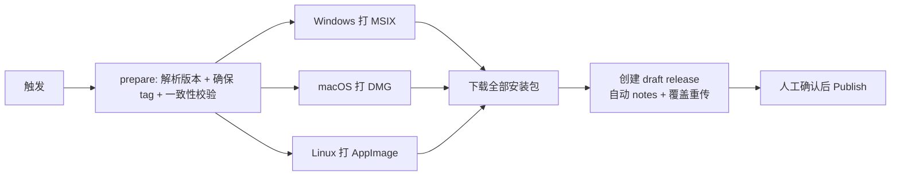

# Fast Forge 打包与发布 — 完整指南与踩坑记录

> 本文档是 CivitAI Box 打包体系的**深度记录**：工具链如何组织、完整打包流程是什么、
> 以及搭建过程中踩过的每一个坑（现象 / 根因 / 解决）。
>
> 需要动手打包/发布时，看简版操作手册 [`packaging.md`](packaging.md)；
> 想理解为什么这么配、遇到问题怎么排查，看本文档。

---

## 1. 背景与关键决策

| 决策 | 内容 | 日期 |
| ---- | ---- | ---- |
| 打包工具 | 用 **Fast Forge**（`fastforge` 0.6.12）统一打包 + 发布 | 2026-08-09 |
| Windows 格式 | **MSIX**（明确不用 Inno Setup） | 2026-08-09 |
| macOS 格式 | **DMG** | 2026-08-09 |
| Linux 格式 | **仅 AppImage**，不做 DEB/RPM | 2026-08-09 |
| 版本管理 | `pubspec.yaml` 的 `version` 是**唯一版本源**，自动打 tag | 2026-08-09 |
| 发布策略 | **draft 草稿**发布，人工确认后再公开；上传用 `action-gh-release` | 2026-08-09 |
| 图标 | 当前用 Flutter 默认图标占位，正式发布前需替换品牌图标 | 2026-08-09 |

---

## 2. 工具链组织（fastforge 0.6.12 内部到底是怎么工作的）

### 2.1 它是什么

`fastforge` 是原 **Flutter Distributor** 改名而来的 Flutter 打包/发布 CLI。
本项目装的是 **0.6.12（Dart 实现）**，命令只有 4 个：

```bash
fastforge package    # 构建 + 打包（调 flutter build → 各平台 maker）
fastforge publish    # 把已有产物上传到分发平台（fir/pgyer/github/...）
fastforge release    # 按 distribute_options.yaml 组合 package + publish
fastforge upgrade    # 升级自身
```

> ⚠️ **坑 1：文档严重滞后于代码。** GitHub 上 `fastforgedev/fastforge` 的 docs
> 是给新的 Rust CLI 写的（命令有 `build`/`workflow`/`--publish-arg` 等），
> 而本机 0.6.12 是旧 Dart CLI，**没有 `build` 命令**，`publish` 参数也不同。
> 一切以 `fastforge <command> --help` 的实际输出为准。

### 2.2 依赖链（理解配置从哪来）

```
fastforge 0.6.12
└── unified_distributor 0.2.12        ← CLI 骨架 + 读取配置 + 调度
    ├── flutter_app_builder 0.6.2     ← 执行 flutter build，定位原始产物
    ├── flutter_app_packager 0.6.11   ← 各平台 maker（msix/dmg/appimage/...）
    │   ├── msix 3.18.0               ← Windows MSIX maker（自带工具链！）
    │   ├── appdmg (Node)             ← macOS DMG maker（需全局安装）
    │   └── appimagetool              ← Linux AppImage maker（需下载）
    └── flutter_app_publisher 0.6.10  ← 上传到各分发平台
```

### 2.3 配置体系（两条线）

**① `distribute_options.yaml`（可选，`release` 命令用）**

项目根的可选文件。**不存在也没关系**——`fastforge package` 直接用默认值：
输出目录 `dist/`。定义了 `releases` + `output`，供 `fastforge release --name X` 用。

**② `<platform>/packaging/<format>/make_config.yaml`（必需！）**

每个 maker 的专属配置，由 `fastforge package` 自动读取。**缺失会直接抛错**。

```
windows/packaging/msix/make_config.yaml   ← MSIX 元数据
macos/packaging/dmg/make_config.yaml      ← appdmg 卷宗布局
linux/packaging/appimage/make_config.yaml ← 桌面条目 + 图标
```

### 2.4 构建 / 打包 / 发布 三阶段

| 阶段 | 做什么 | 输出 |
| ---- | ------ | ---- |
| 构建 | `flutter build windows` | `build/windows/x64/runner/Release/xxx.exe` |
| 打包 | maker 整理成可分发格式 | `dist/<版本>/xxx.msix` |
| 发布 | 上传到 GitHub 等 | Release 资产 |

**宿主限制**（为什么 CI 要用矩阵 runner）：

| 平台 | 只能在 | 原因 |
| ---- | ------ | ---- |
| Windows | Windows | MSIX 工具链 |
| macOS | macOS | Xcode / hdiutil / appdmg |
| Linux | Linux | GTK / appimagetool |

---

## 3. 完整打包流程

### 3.1 本地打一个 MSIX（验证用）

```bash
# 完整打包（会先 flutter clean）
fastforge package --platform windows --targets msix

# 跳过 clean（复用上次构建，调试配置时快很多）
fastforge package --platform windows --targets msix --skip-clean
```

产物：`dist/1.0.0+1/flutter_civitai_box-1.0.0+1-windows.msix`（约 36 MB）

### 3.2 CI 发布工作流（`.github/workflows/release.yml`）



- **prepare**：tag 触发取 tag 名；手动触发自动从 `pubspec.yaml` 读版本 → 打 tag `v<version>`。
- **build**：三平台并行 `fastforge package`。
- **publish**：`softprops/action-gh-release`（`draft: true` + `generate_release_notes` + `overwrite: true`）。

### 3.3 各平台配置要点

- **MSIX**：`display_name` / `publisher_display_name` / `identity_name`（全局唯一）/ `msix_version`(a.b.c.d) / `logo_path` / `languages` / `capabilities` / `install_certificate`
- **DMG**：`title` + `contents`（.app 与 /Applications 快捷方式）+ `window`（appdmg 规范）
- **AppImage**：`display_name` / `icon`（PNG 路径）/ `categories` / `keywords`

---

## 4. 踩坑记录（现象 → 根因 → 解决）

### 坑 1：`MakeMsixConfig` 所有字段都是字符串 → YAML 布尔值必须加引号

**现象**：`fastforge package` 报 `type 'bool' is not a subtype of type 'String?'`，
崩在 `MakeMsixConfig.fromJson`。

**根因**：`flutter_app_packager` 里 `MakeMsixConfig` 的每个字段都是 `String?` 类型
（不是 Dart 的 `bool`）。YAML 写 `false`（未加引号）会被解析成 JSON 布尔值 → 类型不匹配。

**解决**：所有布尔类字段写成字符串：`install_certificate: "false"`。

### 坑 2：`install_certificate` 交互提示 → 后台/CI 直接卡死

**现象**：打包日志停在 `packing msix files...` 再也不动，最后 MSIX 是**未签名**的
（`signtool verify` 报 `No signature found`）。

**根因**：msix 包默认 `install_certificate: true`，会在打包时用 `readInput()` 弹
**"Do you want to install the certificate? (y/N)"**，等用户输入。CI 没人应答 → 卡死，
签名步骤从未执行。

**解决**：`make_config.yaml` 设 `install_certificate: "false"`。
关闭后**仍会用内置 `Msix Testing` 测试证书签名**（只是不装进系统证书库），
`signtool verify /pa` 可通过。

### 坑 3：`languages` 必须是逗号分隔字符串，不是 YAML 列表

**现象**：`type 'List<dynamic>' is not a subtype of type 'String?'`。

**根因**：`MakeMsixConfig.languages` 是 `String?`，msix 包内部用
`(value as String).split(',')` 解析。YAML 列表（`- en-US`）解析成数组 → 类型崩。

**解决**：写成 `languages: en-US,zh-CN`（逗号分隔字符串）。

### 坑 4：`add_execution_alias` 是无效键 → `FormatException`

**现象**：`FormatException: Could not find an option named "--add-execution-alias"`。

**根因**：`MakeMsixConfig` 有这个字段，会转换成 `--add-execution-alias` 传给 msix 包，
但 msix 包的 CLI 参数里**没有这个选项**（对应的是 `--execution-alias`）——字段与实现脱节。

**解决**：干脆不配这个键（命令行启动别名不是必需）。

### 坑 5：MSIX 签名验证不能用 `Get-AuthenticodeSignature`

**现象**：PowerShell `Get-AuthenticodeSignature` 对 MSIX 报 `NotSigned`。

**根因**：MSIX 的签名嵌在 AppX 块映射（block map）里，不是标准 PE/脚本签名，
PowerShell cmdlet 解析不了。

**解决**：用 msix 包自带的 signtool：

```bash
& "C:\Users\GF\AppData\Local\Pub\Cache\hosted\pub.dev\msix-3.18.0\lib\assets\MSIX-Toolkit\Redist.x64\signtool.exe" verify /pa /v <file.msix>
```

### 坑 6：文档说 `package` 只通了 macOS → 实际 0.6.12 支持 MSIX/AppImage 等

**现象**：官方 docs 写"Flutter 项目 `fastforge package` 只接通 macOS 三种格式，
其他平台会报 `Unsupported package target`"。

**根因**：仓库 docs 是为新 Rust CLI 写的，且滞后；本机 0.6.12 的
`package --targets=<apk,aab,...,msix,...,dmg,appimage,deb,rpm,exe,zip>` 明确支持这些。

**解决**：以 `fastforge package --help` 为准，直接实测。（本项目 MSIX 已实测成功。）

### 坑 7：本机终端 PATH 会退化 → 命令突然"不存在"

**现象**：同一终端里 `Get-Content` / `Get-ChildItem` 突然报
`CommandNotFoundException`；`flutter analyze` 有时无任何输出。

**根因**：该机器终端会话 PATH 会退化（长期使用后），与项目无关。

**解决**：

- 读 UTF-16 日志：`& "C:\Windows\System32\cmd.exe" /c "type <file>"`
- 关键验证命令改用完整路径或换用 IDE 工具（文件搜索/读取）。

### 坑 8：`fastforge publish` 上传 GitHub 的两个硬伤 → 换 `action-gh-release`

**现象**：① 同版本重跑报 `Release asset exist [xxx.msix]`（上传失败）；
② 底层 `Stream.fromIterable(fileData.map((e) => [e]))` **按字节逐个**上传，
36~100MB 的包极慢。

**根因**：fastforge 的 GitHub publisher 实现限制：同名资产不覆盖 + 低效流上传。

**解决**：打包仍用 fastforge，上传改用 `softprops/action-gh-release@v2`：
`overwrite: true`（覆盖重传）+ `draft: true`（草稿）+ `generate_release_notes`（自动说明）。

### 坑 9：`GITHUB_TOKEN` 打 tag 不会触发 tag 工作流 → 合并到一个工作流

**现象/隐患**：若"自动打 tag"的工作流用 `GITHUB_TOKEN` push tag，`push: tags: v*`
的发布工作流**不会被触发**（GitHub 官方行为：`GITHUB_TOKEN` 触发的事件不会再生效）。

**解决**：把"读版本 + 打 tag + 构建 + 发布"**合并到同一个 `release.yml`**：
prepare job 打 tag 后，本工作流直接继续构建发布（无需二次触发）。
`workflow_dispatch` 是 `GITHUB_TOKEN` 触发的**例外**，可作为入口。

### 坑 10：AppImage 在 CI 上需要无 FUSE 运行

**现象/隐患**：`appimagetool` 是 AppImage 格式，GitHub Actions 默认无 FUSE，
直接执行会报错。

**解决**：设环境变量 `APPIMAGE_EXTRACT_AND_RUN=1`（自动解压运行）。
Linux 构建还需 `ninja-build libgtk-3-dev liblzma-dev clang cmake pkg-config`。

### 坑 11：`appdmg` 是 Node 工具，需全局安装

**现象/隐患**：DMG maker 的 `requirements` 里是 `appdmg`，若不存在会用
`pnpm install -g appdmg` 尝试装——CI 上未必有 pnpm。

**解决**：CI 显式 `npm install -g appdmg`（macOS runner 自带 Node）。

### 坑 12：MSIX 里的描述/图标用的是占位值

**现象**：MSIX 清单里 `Description: A new Flutter project.`（pubspec 默认描述），
图标是 Flutter 默认 logo。

**根因**：MSIX 的 `Description` 取自 `pubspec.yaml` 的 `description`；
`logo_path` 指向 `web/icons/Icon-512.png`（flutter create 生成的默认图标）。

**解决**：已把 pubspec 描述改为正式文案；图标需在正式发布前替换为品牌图标。

### 坑 13：macOS bundle ID 是默认的 `com.example.*`

**现象/隐患**：`macos/Runner/Configs/AppInfo.xcconfig` 的
`PRODUCT_BUNDLE_IDENTIFIER = com.example.flutterCivitaiBox`（占位）。

**解决**：改为 `com.universalprogressions.civitaibox`。Windows 的 `Runner.rc`
里 `CompanyName`/`LegalCopyright` 仍是 `com.example` 占位，正式发布前建议一并改。

### 坑 14：Linux 构建报 `Could NOT find ALSA`

**现象**：CI 上 `flutter build linux` 报
`Could NOT find ALSA (missing: ALSA_LIBRARY ALSA_INCLUDE_DIR)`，崩在
`volume_controller/linux/CMakeLists.txt` 的 `find_package(ALSA)`。

**根因**：`volume_controller`（`media_kit_video` 的依赖，控制音量）在 Linux 上
需要 **ALSA** 开发库。macOS/Windows 不需要，所以本地 Windows 验证没暴露。

**解决**：CI 的 Linux 构建步骤安装 `libasound2-dev`。

### 坑 15：Linux 构建报 `PkgConfig::mpv ... target was not found`

**现象**：装完 ALSA 后又报
`media_kit_video/linux/CMakeLists.txt:53: Target "media_kit_video_plugin" links to: PkgConfig::mpv but the target was not found`。

**根因**：`media_kit_video` 的 Linux 插件通过 pkg-config 链接 **libmpv**。

**解决**：CI 的 Linux 构建步骤再安装 `libmpv-dev`。
（Linux 完整依赖清单：`ninja-build libgtk-3-dev liblzma-dev clang cmake pkg-config libsecret-1-dev libjsoncpp-dev libstdc++-12-dev libasound2-dev libmpv-dev`）

### 坑 16：Windows 上 fastforge 是 `.bat`，Git Bash 裸名找不到

**现象**：Windows runner 报
`fastforge: command not found`（exit 127），尽管 `$PUB_CACHE/bin` 已加入 PATH。

**根因**：`dart pub global activate` 在 Windows 上生成 `fastforge.bat`（批处理）。
Git Bash 按裸名 `fastforge` 只找 `.exe`/可执行文件，**不会解析 `.bat`**；
而 workflow 的步骤用的是 `shell: bash`。Linux/macOS 上生成的是真实二进制，所以只有 Windows 挂。

**解决**：Package 步骤在 Windows 上显式调用 `.bat` 完整路径：

```yaml
- name: Package with Fast Forge
  shell: bash
  run: |
    if [ "$RUNNER_OS" == "Windows" ]; then
      fastforge_bin="$PUB_CACHE/bin/fastforge.bat"
    else
      fastforge_bin="$PUB_CACHE/bin/fastforge"
    fi
    "$fastforge_bin" package --platform ${{ matrix.platform }} --targets ${{ matrix.targets }}
```

> 这套坑全部落地后（2026-08-09），三个平台 CI 构建首次全部通过：
> Windows MSIX 36MB / macOS DMG 38MB / Linux AppImage 114MB。

### 坑 17：Linux arm64 支持有限 → 放弃（决策）

**现象**：尝试加 `linux-arm64`（`ubuntu-24.04-arm` runner）时，`subosito/flutter-action`
报 `Unable to determine Flutter version for channel: stable version: 3.44.8 architecture: arm64`
——固定版 3.44.8 **没有 Linux arm64 的构建**。

**根因**：Flutter 官方对 **Linux arm64 支持有限**（Linux 桌面 arm64 构建不是一等公民），
且 AppImage/媒体库（mpv 等）在 arm64 上的链路不成熟。

**决策**：**放弃 Linux arm64**（2026-08-09）。最终架构矩阵：
Windows **x64** / macOS **arm64** / Linux **x64**。

> 补充：安装包文件名统一带架构后缀（工作流 `Add architecture to artifact name` 步骤重命名），
> 如 `-windows-setup-x64.exe` / `-macos-arm64.dmg` / `-linux-x64.AppImage`。

### 坑 18：MSIX 自签名证书被 Windows 拦截 → 换 Inno Setup + portable zip（决策）

**现象**：发布后的 MSIX 安装时提示"证书无法验证"（0x800B0100/0x800B0109），无法安装。
（证书是内置 `Msix Testing` 测试证书，非公共 CA 签发。）

**根因**：MSIX 强制要求签名且签名者必须在系统受信任根中；自签名证书默认不受信任 → 硬性拦截。

**解决/决策（2026-08-31）**：**弃用 MSIX**，Windows 改为：

- **Inno Setup 安装器**（fastforge `exe` target）：未签名也**只是 SmartScreen 警告**，点"仍要运行"即可装，
  比 MSIX 的硬性拦截宽松得多。需要 `windows/packaging/exe/make_config.yaml`，CI 上
  `choco install innosetup` 并设 `INNO_SETUP_PATH`。
- **portable zip**（fastforge `zip` target）：免安装、免签名、免证书，解压直接运行。

**经验**：分发选型时——**MSIX 对证书要求最严格**（签名+受信任根），
**EXE 安装器次之**（未签名仅 SmartScreen 警告），**portable zip 最宽松**（无任何证书/安装要求）。
内测期用 zip/EXE 最省事，正式公开再上代码签名（Azure Trusted Signing / 商业证书）。

### 坑 19：换掉 MSIX 后忘了删工作流里的 MSIX 注入步骤

**现象**：Windows job 报
`sed: can't read windows/packaging/msix/make_config.yaml: No such file or directory`（exit 2）。

**根因**：把 `targets: msix` 改成 `exe,zip` 后，工作流里残留的
`Inject MSIX version` 步骤（`sed` 改 `msix_version`）还在跑，但 `windows/packaging/msix/` 已删除。

**解决**：删除该步骤。Inno Setup 的版本号由 exe maker 自动从 pubspec 读取，无需注入。

### 坑 20：Inno 配置 YAML 双引号里的 `\` 被当转义

**现象**：`fastforge package` 解析 `windows/packaging/exe/make_config.yaml` 时报
`Error on line 22, column 43: Unknown escape character`（指向 `install_dir_name: "{localappdata}\Programs\..."`）。

**根因**：YAML 双引号字符串会把 `\P` 当转义序列；Windows 路径里的单反斜杠在双引号里不合法。

**解决**：改用**单引号**包裹含反斜杠的值：
`install_dir_name: '{localappdata}\Programs\CivitAI Box'`（单引号不处理转义）。

### 坑 21：Inno AppId 必须是双左花括号 `{{GUID}`

**现象**：ISCC 编译报
`Error on line 2 ... Unknown constant "90bd9d36-...". Use two consecutive "{" characters...`（Compile aborted）。

**根因**：Inno Setup 的 `AppId` 规范格式是 `AppId={{GUID}`——**两个**左花括号（`{{` 转义出字面 `{`）+ GUID + 一个右花括号。
配了单个 `{90bd9d36-...}` 会被 Inno 当成常量引用而报错。

**解决**：`app_id: "{{90bd9d36-c15c-4712-9ba6-a754b1f8ada8}"`（双左花括号）。

---

## 5. 验证与排查速查

| 需求 | 命令/方法 |
| ---- | --------- |
| 本地打 Windows Inno 安装器 | `fastforge package --platform windows --targets exe --skip-clean`（需本机装 Inno Setup 6） |
| 本地打 Windows portable zip | `fastforge package --platform windows --targets zip --skip-clean` |
| 验证 MSIX 签名（已弃用） | `signtool.exe verify /pa /v <file.msix>`（用 msix 包自带工具） |
| 查看 MSIX 清单 | 解压后读 `AppxManifest.xml`（MSIX 本质是 zip） |
| 看 fastforge 实际支持什么 | `fastforge package --help`（别信旧文档） |
| 读 UTF-16 构建日志 | `& "C:\Windows\System32\cmd.exe" /c "type <file>"` |

## 6. 常见问题 FAQ

**Q：`fastforge package` 报 `type '...' is not a subtype of type 'String?'`？**
A：检查 `make_config.yaml` 里是不是有 YAML 列表/布尔值。该 maker 所有字段都要
字符串：列表改逗号分隔，布尔改 `"true"`/`"false"`。

**Q：打包卡在 `packing msix files...`？**
A：msix 包在等证书安装的交互确认。设 `install_certificate: "false"`。

**Q：MSIX 安装时提示不受信任 / SmartScreen 警告？**
A：用的是内置 `Msix Testing` 测试证书。正式发布换真实代码签名证书
（`make_config.yaml` 配 `certificate_path` / `certificate_password` / `publisher`）。

**Q：重跑同一版本发布失败？**
A：现在是 `action-gh-release` + `overwrite: true`，会自动覆盖，不会再失败。

**Q：手动触发时提示 tag 已存在？**
A：pubspec 版本没改就会复用旧 tag。发新版本先去改 `pubspec.yaml` 的 `version`。

**Q：macOS/Linux 首次跑 CI 要注意什么？**
A：DMG 依赖 `appdmg`、AppImage 依赖 `appimagetool`（工作流已自动装好）；
macOS 未公证的包会被 Gatekeeper 拦截，正式发布需 Apple Developer 证书。
