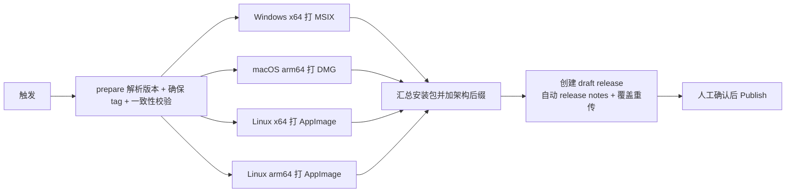

# 打包与发布（Packaging & Release）

> 本文档说明如何用 **Fast Forge** 将 CivitAI Box 打包成三大桌面平台的安装包，
> 并通过 GitHub Actions 自动发布到 **GitHub Releases**。

## 目标安装包

| 平台 | 架构 | 格式 | 说明 |
| ---- | ---- | ---- | ---- |
| Windows | **x64** | **MSIX + zip** | MSIX 正式安装包（需受信证书）；**zip = portable 免安装版**，解压即用、无需签名 |
| macOS | **arm64** | **DMG** | 拖拽安装的磁盘映像（Apple Silicon） |
| Linux | **x64** | **AppImage** | 免安装、便携的单文件应用 |

安装包文件名带架构后缀，例如：
`flutter_civitai_box-1.0.0+1-windows-x64.msix`、
`flutter_civitai_box-1.0.0+1-windows-x64.zip`（portable）、
`flutter_civitai_box-1.0.0+1-macos-arm64.dmg`、
`flutter_civitai_box-1.0.0+1-linux-x64.AppImage`。

> **为什么有 zip？** MSIX 用自签名测试证书时 Windows 会拦截安装（证书不受信）。
> portable zip **不要求签名/安装**，解压后直接运行 `flutter_civitai_box.exe`，
> 是证书问题解决前最省事的 Windows 分发方式。

> 决策（2026-08-09）：Windows 只做 x64、macOS 只做 arm64、Linux 只做 x64；
> Linux 只保留 AppImage，不做 DEB/RPM。**Linux arm64 曾尝试后放弃**
> （Flutter 官方对 Linux arm64 支持有限，`flutter-action` 对固定版 3.44.8 无 arm64 构建）。

## 工具链

- **Fast Forge**（`fastforge` 0.6.x）：基于 Dart 的 Flutter 打包/发布 CLI
  - 安装：`dart pub global activate fastforge`
  - 本机路径：`C:\Users\GF\AppData\Local\Pub\Cache\bin\fastforge.bat`
- 各平台 maker 依赖（CI 已自动安装）：
  - Windows MSIX：`msix` 包自带工具链（MakeAppx / MakePri / signtool），**无需额外安装**
  - macOS DMG：`appdmg`（Node 工具，`npm install -g appdmg`）
  - Linux AppImage：`appimagetool`（需下载，无 FUSE 环境用 `APPIMAGE_EXTRACT_AND_RUN=1`）

## 配置结构

```
windows/packaging/msix/make_config.yaml   ← MSIX 元数据（显示名、发布者、标识、图标、版本）
macos/packaging/dmg/make_config.yaml      ← DMG 卷宗布局（appdmg 规范）
linux/packaging/appimage/make_config.yaml ← AppImage 桌面条目与图标
.github/workflows/release.yml             ← GitHub Actions 发布工作流
```

> 这些 `make_config.yaml` 由 `fastforge package` 自动读取，**缺少会直接报错**。
> 输出目录固定为 `dist/`（`fastforge` 默认值）。

## 本地打包（Windows）

```bash
# 完整打包（会先 flutter clean）
fastforge package --platform windows --targets msix

# 跳过 clean（复用上次构建，调试打包配置时更快）
fastforge package --platform windows --targets msix --skip-clean
```

产物输出到 `dist/<版本>/`，例如 `dist/1.0.0/flutter_civitai_box-1.0.0+1-windows-setup.msix`。

## 发布到 GitHub Releases

工作流 `.github/workflows/release.yml` 支持两种触发方式。

**版本管理原则：`pubspec.yaml` 的 `version` 是唯一版本源**——工作流会校验
pubspec 版本与 tag 一致，MSIX 版本号也由发布版本自动注入。

### 方式一：手动触发（推荐，自动打 tag）

1. 在 `pubspec.yaml` 中把 `version:` 改为目标版本（如 `1.1.0+2`）
2. 提交并推送
3. GitHub → Actions → **Build & Release** → **Run workflow**（**无需填任何输入**）

工作流会自动：

- 从 pubspec 读取版本（去掉 `+build`）→ 创建并推送 tag `v1.1.0`
- 三个平台并行打包 → 汇总上传 → 生成 **draft（草稿）release**
- 你到 Releases 页核对安装包无误后，手动点 **Publish release** 公开

### 方式二：推送 tag

```bash
git tag v1.1.0
git push origin v1.1.0
```

### 工作流做了什么



- **打包**：`fastforge package`（Windows MSIX / macOS DMG / Linux AppImage）
- **架构**：
  - Windows：`windows-latest`（x64），MSIX 配置显式 `architecture: x64`
  - macOS：`macos-14`（arm64 runner）
  - Linux：`ubuntu-latest`（x64）+ `ubuntu-24.04-arm`（arm64 runner）；
    ARM 版需额外下载 `appimagetool-aarch64` 并给 fastforge 的 AppImage maker
    打 `ARCH=aarch64` 补丁（fastforge 硬编码 x86_64）
- **文件名**：打包后加一个步骤，在扩展名前插入架构后缀（`-x64` / `-arm64`）
- **上传**：`softprops/action-gh-release`，`draft: true` + `generate_release_notes: true`
  - `overwrite: true`（重跑会覆盖同名安装包，不会报错）
- **权限**：工作流自动注入 `GITHUB_TOKEN`，无需额外配置

> **注意**：发布的是 **draft 草稿**，安装包上传完不会自动公开。
> 请到 GitHub Releases 页确认后手动点击 **Publish release**。

## 发布前检查清单

- [ ] **替换正式品牌图标**：当前 MSIX/AppImage 使用 `web/icons/Icon-512.png`（Flutter 默认图标）占位，
      请替换为真正的应用图标（建议 512×512 PNG），再更新：
  - `windows/packaging/msix/make_config.yaml` → `logo_path`
  - `linux/packaging/appimage/make_config.yaml` → `icon`
- [ ] **更新 Windows 应用元数据**：`windows/runner/Runner.rc` 中 `CompanyName`、
      `LegalCopyright`、`FileDescription` 仍为 `com.example` 占位值，建议改成正式信息。
- [ ] **确认 macOS bundle ID**：已改为 `com.universalprogressions.civitaibox`。
- [ ] **签名策略**：
  - MSIX 默认使用内置测试证书自动签名（可安装，但会触发 SmartScreen 警告）。
        正式发布建议配置真实代码签名证书（在 `make_config.yaml` 中设置
        `certificate_path` / `certificate_password` / `publisher`）。
  - macOS 未配置开发者证书时不会公证（Gatekeeper 会拦截），正式发布需 Apple Developer 证书。
- [ ] **跨平台视频库**：`pubspec.yaml` 已加入 `media_kit_libs_macos_video` 与
      `media_kit_libs_linux`，确保 macOS/Linux 上视频预览（模型缩略图）可用。
- [ ] **本地跑一遍测试**：`flutter test` 全绿后再发版。

## 相关命令速查

```bash
fastforge package --platform windows --targets msix   # 打 MSIX
fastforge package --platform macos --targets dmg      # 打 DMG（需 macOS）
fastforge package --platform linux --targets appimage # 打 AppImage（需 Linux）
fastforge --help                                      # 查看全部命令
```

> GitHub Releases 上传由工作流内的 `softprops/action-gh-release` 负责；
> `fastforge publish` 仅在本机手动发布其他目标（fir/pgyer/...）时使用。
