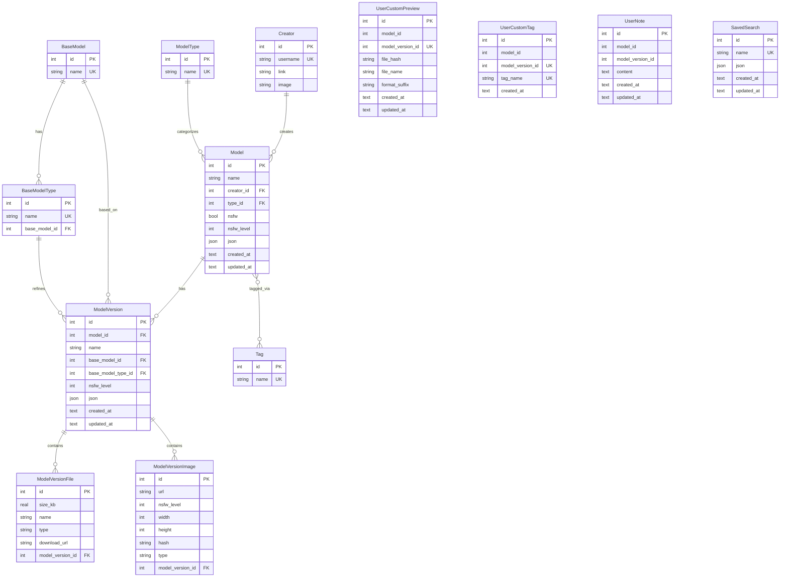

# CivitAI Box — Database Schema

> Migrated from the `bun-civitai-browser` Prisma schema.  
> Implemented via **sqflite** (SQLite) on Flutter.

---

## Entity-Relationship Overview



---

## Tables

### 1. `creator`

Stores CivitAI user/creator profiles.

| Column     | Type      | Constraints                 |
| ---------- | --------- | --------------------------- |
| `id`       | `INTEGER` | `PRIMARY KEY AUTOINCREMENT` |
| `username` | `TEXT`    | `NOT NULL UNIQUE`           |
| `link`     | `TEXT`    | nullable                    |
| `image`    | `TEXT`    | nullable (avatar URL)       |

**Index:** `idx_creator_username` on (`username`).

---

### 2. `model_type`

Lookup table for model categories (Checkpoint, LoRA, VAE, etc.).

| Column | Type      | Constraints                 |
| ------ | --------- | --------------------------- |
| `id`   | `INTEGER` | `PRIMARY KEY AUTOINCREMENT` |
| `name` | `TEXT`    | `NOT NULL UNIQUE`           |

**Index:** `idx_model_type_name` on (`name`).

---

### 3. `tag`

Lookup table for tags applied to models.

| Column | Type      | Constraints                 |
| ------ | --------- | --------------------------- |
| `id`   | `INTEGER` | `PRIMARY KEY AUTOINCREMENT` |
| `name` | `TEXT`    | `NOT NULL UNIQUE`           |

**Index:** `idx_tag_name` on (`name`).

---

### 4. `base_model`

Lookup table for base model names (SD 1.5, SDXL, Flux, etc.).

| Column | Type      | Constraints                 |
| ------ | --------- | --------------------------- |
| `id`   | `INTEGER` | `PRIMARY KEY AUTOINCREMENT` |
| `name` | `TEXT`    | `NOT NULL UNIQUE`           |

**Index:** `idx_base_model_name` on (`name`).

---

### 5. `base_model_type`

Sub-classifications within a base model (e.g., SDXL → "Illustrious").

| Column          | Type      | Constraints                       |
| --------------- | --------- | --------------------------------- |
| `id`            | `INTEGER` | `PRIMARY KEY AUTOINCREMENT`       |
| `name`          | `TEXT`    | `NOT NULL UNIQUE`                 |
| `base_model_id` | `INTEGER` | `NOT NULL`, `FK → base_model(id)` |

**Index:** `idx_base_model_type_name` on (`name`, `base_model_id`).

---

### 6. `model`

Core table — each row is one CivitAI model.

| Column       | Type      | Constraints                             |
| ------------ | --------- | --------------------------------------- |
| `id`         | `INTEGER` | `PRIMARY KEY` (CivitAI model id)        |
| `name`       | `TEXT`    | `NOT NULL`                              |
| `creator_id` | `INTEGER` | nullable, `FK → creator(id)`            |
| `type_id`    | `INTEGER` | `NOT NULL`, `FK → model_type(id)`       |
| `nsfw`       | `INTEGER` | `NOT NULL DEFAULT 0` (boolean 0/1)      |
| `nsfw_level` | `INTEGER` | `NOT NULL`                              |
| `json`       | `TEXT`    | `NOT NULL DEFAULT '{}'` (full API JSON) |
| `created_at` | `TEXT`    | `NOT NULL DEFAULT (datetime('now'))`    |
| `updated_at` | `TEXT`    | `NOT NULL DEFAULT (datetime('now'))`    |

**Index:** `idx_model_lookup` on (`name`, `type_id`, `creator_id`, `nsfw`, `nsfw_level`).

---

### 7. `model_tags` (Junction)

Many-to-many relationship between `model` and `tag`.

| Column     | Type      | Constraints                              |
| ---------- | --------- | ---------------------------------------- |
| `model_id` | `INTEGER` | `PK`, `FK → model(id) ON DELETE CASCADE` |
| `tag_id`   | `INTEGER` | `PK`, `FK → tag(id) ON DELETE CASCADE`   |

**Primary Key:** composite (`model_id`, `tag_id`).  
**Index:** `idx_model_tags_tag` on (`tag_id`).

---

### 8. `model_version`

Each model can have multiple versions (e.g., v1, v2, inpainting variant).

| Column               | Type      | Constraints                                    |
| -------------------- | --------- | ---------------------------------------------- |
| `id`                 | `INTEGER` | `PRIMARY KEY` (CivitAI version id)             |
| `model_id`           | `INTEGER` | `NOT NULL`, `FK → model(id) ON DELETE CASCADE` |
| `name`               | `TEXT`    | `NOT NULL`                                     |
| `base_model_id`      | `INTEGER` | `NOT NULL`, `FK → base_model(id)`              |
| `base_model_type_id` | `INTEGER` | nullable, `FK → base_model_type(id)`           |
| `nsfw_level`         | `INTEGER` | `NOT NULL`                                     |
| `json`               | `TEXT`    | `NOT NULL DEFAULT '{}'` (full API JSON)        |
| `created_at`         | `TEXT`    | `NOT NULL DEFAULT (datetime('now'))`           |
| `updated_at`         | `TEXT`    | `NOT NULL DEFAULT (datetime('now'))`           |

**Index:** `idx_model_version_lookup` on (`model_id`, `name`, `base_model_id`, `base_model_type_id`, `nsfw_level`).

---

### 9. `model_version_file`

Downloadable files attached to a model version.

| Column                 | Type      | Constraints                                            |
| ---------------------- | --------- | ------------------------------------------------------ |
| `id`                   | `INTEGER` | `PRIMARY KEY` (CivitAI file id)                        |
| `size_kb`              | `REAL`    | `NOT NULL`                                             |
| `name`                 | `TEXT`    | `NOT NULL`                                             |
| `type`                 | `TEXT`    | `NOT NULL` (e.g. `Model`, `Config`, `VAE`)             |
| `download_url`         | `TEXT`    | `NOT NULL`                                             |
| `model_version_id`     | `INTEGER` | `NOT NULL`, `FK → model_version(id) ON DELETE CASCADE` |

---

### 10. `model_version_image`

Preview images attached to a model version.

| Column                 | Type      | Constraints                                            |
| ---------------------- | --------- | ------------------------------------------------------ |
| `id`                   | `INTEGER` | `PRIMARY KEY` (CivitAI image id)                       |
| `url`                  | `TEXT`    | `NOT NULL`                                             |
| `nsfw_level`           | `INTEGER` | `NOT NULL`                                             |
| `width`                | `INTEGER` | `NOT NULL`                                             |
| `height`               | `INTEGER` | `NOT NULL`                                             |
| `hash`                 | `TEXT`    | `NOT NULL` (perceptual hash)                           |
| `type`                 | `TEXT`    | `NOT NULL` (e.g. `image`)                              |
| `model_version_id`     | `INTEGER` | `NOT NULL`, `FK → model_version(id) ON DELETE CASCADE` |

---

### 11. `user_custom_preview`

User-defined custom cover image per model version. **No FK → survives model deletion.**

| Column             | Type      | Constraints                 |
| ------------------ | --------- | --------------------------- |
| `id`               | `INTEGER` | `PRIMARY KEY AUTOINCREMENT` |
| `model_id`         | `INTEGER` | `NOT NULL`                  |
| `model_version_id` | `INTEGER` | `NOT NULL UNIQUE`           |
| `file_hash`        | `TEXT`    | `NOT NULL` (SHA256)         |
| `file_name`        | `TEXT`    | `NOT NULL`                  |
| `format_suffix`    | `TEXT`    | `NOT NULL` (png/jpg/webp)   |
| `created_at`       | `TEXT`    | `NOT NULL DEFAULT (datetime('now'))` |
| `updated_at`       | `TEXT`    | `NOT NULL DEFAULT (datetime('now'))` |

**Indexes:** `idx_user_custom_preview_model` on (`model_id`),  
`idx_user_custom_preview_version` on (`model_version_id`).

File path: `{basePath}/user_custom/previews/{modelId}_{versionId}.{format_suffix}`

---

### 12. `user_custom_tag`

User-defined free-text tags on a model version. Displayed separately from CivitAI official tags. **No FK → survives model deletion.**

| Column             | Type      | Constraints                                   |
| ------------------ | --------- | --------------------------------------------- |
| `id`               | `INTEGER` | `PRIMARY KEY AUTOINCREMENT`                   |
| `model_id`         | `INTEGER` | `NOT NULL`                                    |
| `model_version_id` | `INTEGER` | `NOT NULL`                                    |
| `tag_name`         | `TEXT`    | `NOT NULL`                                    |
| `created_at`       | `TEXT`    | `NOT NULL DEFAULT (datetime('now'))`          |

**Unique:** composite (`model_version_id`, `tag_name`).  
**Indexes:** `idx_user_custom_tag_version` on (`model_version_id`),  
`idx_user_custom_tag_name` on (`tag_name`).

---

### 13. `user_note`

Markdown notes at **model level** or **version level** via partial unique indexes. **No FK → survives model deletion.**

| Column             | Type      | Constraints                                       |
| ------------------ | --------- | ------------------------------------------------- |
| `id`               | `INTEGER` | `PRIMARY KEY AUTOINCREMENT`                       |
| `model_id`         | `INTEGER` | `NOT NULL`                                        |
| `model_version_id` | `INTEGER` | nullable (`NULL` = model-level note)              |
| `content`          | `TEXT`    | `NOT NULL DEFAULT ''` (Markdown)                  |
| `created_at`       | `TEXT`    | `NOT NULL DEFAULT (datetime('now'))`              |
| `updated_at`       | `TEXT`    | `NOT NULL DEFAULT (datetime('now'))`              |

**Partial unique indexes:**

- `idx_user_note_model` on (`model_id`) WHERE `model_version_id IS NULL` — one note per model
- `idx_user_note_version` on (`model_version_id`) WHERE `model_version_id IS NOT NULL` — one note per version

---

### 14. `saved_search`

Persisted filter presets. JSON payload mirrors `ModelFilters` from `filter_panel.dart`.

| Column       | Type      | Constraints                             |
| ------------ | --------- | --------------------------------------- |
| `id`         | `INTEGER` | `PRIMARY KEY AUTOINCREMENT`             |
| `name`       | `TEXT`    | `NOT NULL UNIQUE`                       |
| `json`       | `TEXT`    | `NOT NULL DEFAULT '{}'`                 |
| `created_at` | `TEXT`    | `NOT NULL DEFAULT (datetime('now'))`    |
| `updated_at` | `TEXT`    | `NOT NULL DEFAULT (datetime('now'))`    |

JSON schema:

```json
{
  "query": "string?",
  "username": "string?",
  "types": ["string"],
  "baseModels": ["string"],
  "tags": ["string"],
  "nsfw": "bool?"
}
```

---

## Prisma → sqflite Type Mapping

| Prisma Type  | SQLite (sqflite) | Notes                               |
| ------------ | ---------------- | ----------------------------------- |
| `Int`        | `INTEGER`        |                                     |
| `String`     | `TEXT`           |                                     |
| `Float`      | `REAL`           |                                     |
| `Boolean`    | `INTEGER`        | `0` = false, `1` = true             |
| `DateTime`   | `TEXT`           | ISO‑8601 string (`datetime('now')`) |
| `Json`       | `TEXT`           | Serialised JSON string              |
| `@id`        | `PRIMARY KEY`    |                                     |
| `@unique`    | `UNIQUE`         |                                     |
| `@@index`    | `CREATE INDEX`   |                                     |
| Implicit m:n | Junction table   | e.g. `model_tags`                   |

---

## Architecture — DAO + Repository

| Layer          | Directory            | Scope                                           | SQL Style                                |
| -------------- | -------------------- | ----------------------------------------------- | ---------------------------------------- |
| **DAO**        | `lib/db/dao/`        | Single-table CRUD                               | sqflite `insert`/`query` API             |
| **Repository** | `lib/db/repository/` | Cross-table business logic, JOINs, transactions | `rawQuery` / `rawInsert` / `transaction` |

DAOs provide atomic operations (insert, upsert, delete, simple lookups).
Repositories compose DAOs and raw SQL to implement cascading upserts,
multi-table pagination, and transactional deletes — all in idiomatic SQLite.

---

## DAO Classes

Each table has a corresponding DAO class in `lib/db/dao/`:

| Table                  | DAO Class              |
| ---------------------- | ---------------------- |
| `creator`              | `CreatorDao`           |
| `model_type`           | `ModelTypeDao`         |
| `tag`                  | `TagDao`               |
| `base_model`           | `BaseModelDao`         |
| `base_model_type`      | `BaseModelTypeDao`     |
| `model` + `model_tags` | `ModelDao`             |
| `model_version`        | `ModelVersionDao`      |
| `model_version_file`   | `ModelVersionFileDao`  |
| `model_version_image`  | `ModelVersionImageDao` |
| `user_custom_preview`  | `UserCustomPreviewDao`  |
| `user_custom_tag`      | `UserCustomTagDao`      |
| `user_note`            | `UserNoteDao`           |
| `saved_search`         | `SavedSearchDao`        |

All DAOs follow a consistent pattern: `insert`, `upsert`, `upsertAll`, `getById`, `getAll`, `delete`.  
`ModelDao` additionally manages the `model_tags` junction via `linkTag`, `setTags`, `getTagIds`, and `unlinkTag`.  
`TagDao` includes a `search(String query)` method using `LIKE` with `COLLATE NOCASE`.
`UserCustomTagDao` provides `replaceTags` for atomic tag-set replacement per version.
`UserNoteDao` supports dual-level notes via separate model-level and version-level methods.

## Repository Classes

Business logic that spans multiple tables lives in `lib/db/repository/`:

| Repository               | Key Operations                                                                                                                                                                                                        |
| ------------------------ | --------------------------------------------------------------------------------------------------------------------------------------------------------------------------------------------------------------------- |
| `ModelRepository`        | `upsertModel` — cascade creator/type/tags in a transaction<br>`queryModels` — JOIN + subquery filtering + `COUNT` + cursor/offset pagination                                                                          |
| `ModelVersionRepository` | `upsertVersion` — cascade baseModel/type/model/images/files in a transaction<br>`deleteVersion` — delete version + auto-remove orphan model<br>`deleteMultipleVersions` — batch delete with per-item error collection |

Both repositories use raw SQL (`INSERT … ON CONFLICT DO UPDATE`, `SELECT … JOIN`, `COUNT`) wrapped
in `db.transaction()` for atomicity — matching SQLite idioms rather than ORM abstractions.

---

## Usage Quick-Start

```dart
import 'package:flutter_civitai_box/db/db.dart';

Future<void> example() async {
  // Initialise (call once, e.g. in main()):
  final db = await CivitaiDatabase.instance;

  // --- DAO level (single table) ---
  const typeDao = ModelTypeDao();
  await typeDao.upsert({'id': 1, 'name': 'Checkpoint'});

  const tagDao = TagDao();
  final suggestions = await tagDao.search('portrait');

  // --- Repository level (cross-table, transactional) ---
  const modelRepo = ModelRepository();
  await modelRepo.upsertModel(
    id: 123,
    name: 'My Model',
    creatorJson: {'username': 'alice', 'link': 'https://...', 'image': null},
    modelTypeName: 'Checkpoint',
    tagNames: ['portrait', 'fantasy'],
    nsfw: false,
    nsfwLevel: 0,
    modelJson: {/* full API JSON */},
  );

  // Paginated listing with filters
  final (:records, :totalCount) = await modelRepo.queryModels(
    types: ['Checkpoint', 'LORA'],
    tags: ['portrait'],
    baseModels: ['SDXL'],
    limit: 20,
    page: 1,
  );

  // Upsert a model version with images and files
  const versionRepo = ModelVersionRepository();
  await versionRepo.upsertVersion(
    id: 456,
    modelId: 123,
    name: 'v1.0',
    baseModelName: 'SDXL',
    baseModelTypeName: 'Illustrious',
    nsfwLevel: 0,
    versionJson: {/* full API JSON */},
    modelJson: {/* full API JSON */},
    modelName: 'My Model',
    creatorJson: {'username': 'alice'},
    modelTypeName: 'Checkpoint',
    tagNames: ['portrait'],
    modelNsfw: false,
    modelNsfwLevel: 0,
    images: [/* ModelImage maps */],
    files: [/* ModelFile maps */],
  );

  // Delete a version (auto-removes orphan model)
  final result = await versionRepo.deleteVersion(456);
  print('Deleted: model=${result.modelDeleted}, files=${result.fileCount}');
}
```
