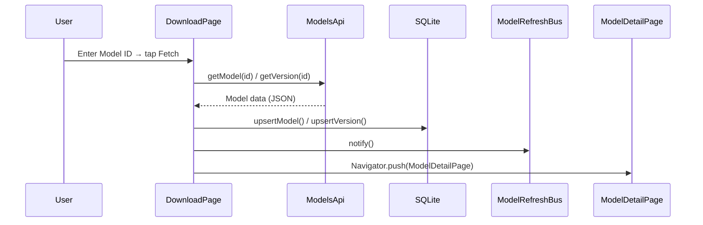

# Download Page — Implementation Plan

> **Created**: 2026-06-01  
> **Scope**: Fetch CivitAI model data by ID, upsert to local DB, display in ModelDetailPage

---

## 🎯 Overview

```
┌─────────────────────────────────────────────────────────────┐
│                    DOWNLOAD PAGE                            │
├─────────────────────────────────────────────────────────────┤
│  Input: [Model ID or Version ID]        [Fetch]             │
│                                                             │
│  On success:                                                │
│    1. API fetch via ModelsApi.getModel(id) or getVersion(id)│
│    2. Upsert to local DB (ModelRepository / VersionRepo)    │
│    3. Navigator.push → ModelDetailPage                      │
│    4. ModelRefreshBus.notify()                              │
└─────────────────────────────────────────────────────────────┘
```

---

## 📋 Task Breakdown

### Phase 1 — Core Download Page ✅

| # | Task | File(s) | Status |
|---|------|---------|--------|
| 1.1 | Create `DownloadPage` with dual-input UI | `ui/download/download_page.dart` | ✅ |
| 1.2 | Add model ID fetch → upsert → navigate logic | `ui/download/download_page.dart` | ✅ |
| 1.3 | Add version ID fetch → upsert → navigate logic | `ui/download/download_page.dart` | ✅ |
| 1.4 | Register `DownloadPage` in `MainShell` navigation | `main.dart` | ✅ |
| 1.5 | Handle error states (not found, network error) | `ui/download/download_page.dart` | ✅ |

### Phase 2 — Version Preview & Download

| # | Task | File(s) | Status |
|---|------|---------|--------|
| 2.1 | Version cards with thumbnails + file info | `ui/download/download_page.dart` | ✅ |
| 2.2 | Download task table DDL | `db/tables.dart` | ⬜ |
| 2.3 | DownloadTaskDao + DownloadTaskManager service | `services/` | ⬜ |
| 2.4 | Single-version download via background_downloader | `ui/download/` | ⬜ |
| 2.5 | Multi-select + batch download | `ui/download/` | ⬜ |
| 2.6 | Task queue badge in navigation | `main.dart` | ⬜ |

### Phase 3 — Download Task System

| # | Task | File(s) | Status |
|---|------|---------|--------|
| 3.1 | FIFO queue engine (enqueue / dequeue / retry) | `services/download_task_manager.dart` | ⬜ |
| 3.2 | App restart: restore pending tasks from DB | `services/download_task_manager.dart` | ⬜ |
| 3.3 | Auto-upsert to DB on download complete | `services/download_task_manager.dart` | ⬜ |
| 3.4 | Progress stream → reactive UI | `services/download_task_manager.dart` | ⬜ |

---

## 🧩 UI Design

```
┌─ Download ───────────────────────────────┐
│                                           │
│  Load type:  [Model ID ▼]                 │
│                                           │
│  Model ID:   [11821_______________]        │
│              or                           │
│  Version ID: [456789_______________]       │
│                                           │
│  [Fetch from CivitAI]                     │
│                                           │
│  ── status ────────────────────────────── │
│  Fetching model 11821...                  │
│  ✅ Model loaded — opening detail page…   │
│  ❌ Model not found                       │
│                                           │
└───────────────────────────────────────────┘
```

---

## 🔄 Data Flow



---

## 🔧 Input Modes

| Mode | API Call | After Load |
|------|----------|------------|
| Model ID | `ModelsApi.getModel(id)` → gets model + all versions | Navigate to `ModelDetailPage`, default to first version tab |
| Version ID | Need version-to-model lookup + version detail fetch | Navigate to `ModelDetailPage`, jump to specific version tab |

---

## ⚠️ Edge Cases

| Case | Handling |
|------|----------|
| Invalid ID (NaN) | Show validation error |
| API returns 404 | Show "Model not found" |
| Network error | Show retry option |
| Model already exists in DB | Still navigate to detail page (data refreshed) |
| Version ID belongs to a model not in DB | Fetch parent model + all versions, upsert everything |

---

## 🗂 Navigation Layout

```
[Local Models]  [Download]  [Settings]
       ↑            ↑            ↑
     index 0      index 1      index 2
```
