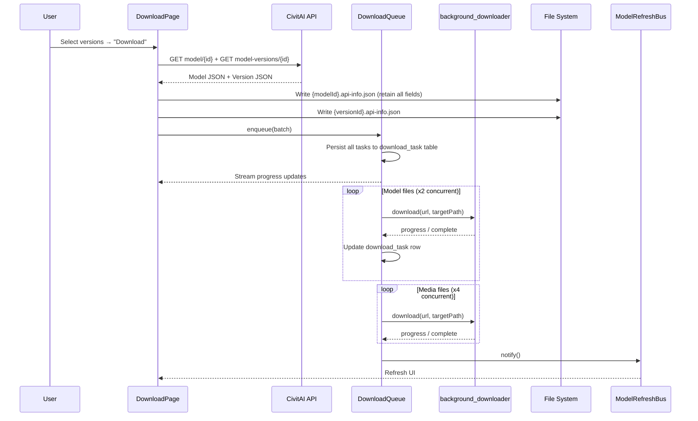

# Download System — Implementation Plan

> **Created**: 2026-06-01  
> **Revised**: 2026-06-02 — merged Phase 2 & Phase 3 into unified download task system  
> **Scope**: Fetch CivitAI model/version data, download all files, persist to disk, show queue

---

## 🎯 Core Design Principles

| Principle          | Decision                                                |
| ------------------ | ------------------------------------------------------- |
| **Atomic unit**    | Download by **ModelVersion** — one version = one batch  |
| **Persistence**    | `download_task` table survives app restart              |
| **Concurrency**    | Batched: model files first (x2), then media files (x4)  |
| **Downloader**     | `background_downloader` — supports background execution |
| **UI**             | Merged into Download page (Fetch on top, Queue below)   |
| **Post-download**  | `ModelRefreshBus.notify()` — no full scanner needed     |
| **File existence** | Check disk, no extra DB flag                            |

---

## 🗄 Database

### `download_task` Table

```sql
CREATE TABLE download_task (
  id                   TEXT    PRIMARY KEY,           -- UUID
  batch_id             TEXT    NOT NULL,              -- groups tasks under one ModelVersion
  model_id             INTEGER NOT NULL,
  model_version_id     INTEGER NOT NULL,
  file_name            TEXT    NOT NULL,
  file_size_kb         REAL    NOT NULL,
  download_url         TEXT    NOT NULL,
  target_path          TEXT    NOT NULL,              -- full disk path
  file_type            TEXT    NOT NULL,              -- 'model' | 'media' | 'api_json'
  status               TEXT    NOT NULL DEFAULT 'pending',
                       -- pending | downloading | completed | failed | cancelled
  progress             REAL    NOT NULL DEFAULT 0,    -- 0.0 ~ 1.0
  error_message        TEXT,
  background_task_id   TEXT,                          -- background_downloader task ID
  created_at           TEXT    NOT NULL,
  updated_at           TEXT    NOT NULL
);

CREATE INDEX idx_download_task_batch ON download_task(batch_id);
CREATE INDEX idx_download_task_status ON download_task(status);
```

### Batch Concept

A **batch** groups all tasks for one ModelVersion (derived from `batch_id`):

| `file_type` | Files per batch           | Priority                          | Concurrent |
| ----------- | ------------------------- | --------------------------------- | ---------- |
| `api_json`  | 2 (model + version)       | 0 — writes instantly, no download | —          |
| `model`     | 1~3 (.safetensors, .ckpt) | 1 — downloads first               | x2         |
| `media`     | 5~20 (.jpeg, .png, .mp4)  | 2 — downloads after models done   | x4         |

---

## 📁 File Layout (per `file_layout.dart`)

```txt
{basePath}/
  {modelType}/                          ← e.g. Checkpoint, LoRA
    {modelId}/
      {modelId}.api-info.json           ← GET /api/v1/models/{modelId}
      {versionId}/
        {versionId}.api-info.json       ← GET /api/v1/model-versions/{versionId}
        files/
          model.safetensors             ← files[].downloadUrl
          model_fp16.safetensors
        media/
          {imageId}.jpeg                ← images[].url → extract numeric ID
          {imageId}.mp4
```

### ⚠️ API JSON 字段使用规范

| 文件                        | 来源                              | 限制 | 说明                                     |
| --------------------------- | --------------------------------- | ---- | ---------------------------------------- |
| `{modelId}.api-info.json`   | `GET /api/v1/models/{id}`         | 无   | 完整保留所有字段（包括 `modelVersions`） |
| `{versionId}.api-info.json` | `GET /api/v1/model-versions/{id}` | 无   | 完整保留                                 |

> **Note**: Model-level JSON 保留 `modelVersions`。写放大对 QLC SSD 影响可忽略。

---

## 🏗 Architecture

```txt
lib/
├── services/
│   └── download/
│       ├── download_task.dart          — Data models (DownloadTask, DownloadBatch, status enum)
│       ├── download_database.dart      — CRUD for download_task table
│       └── download_queue.dart         — Queue engine (enqueue, execute, pause, resume, restore on startup)
└── ui/
    └── download/
        ├── download_page.dart          — Merged page (Fetch section + Queue section)
        └── widgets/
            ├── download_batch_card.dart — One ModelVersion batch with expandable file list
            └── download_task_tile.dart  — Single file progress bar + status icon
```

## 🔄 Data Flow



## 🎨 UI Design

```markdown
+-- Download -----------------------------------+
| |
| -- Fetch ------------------------------------|
| Load type: [Model ID v] |
| ID: [12345________] [Fetch] |
| |
| v dreamshaper (Checkpoint) [select all]
| [x] v8 2 files, 3.2 GB |
| [ ] v7 1 file, 2.1 GB |
| v anything-v5 (LoRA) |
| [x] v3 1 file, 144 MB |
| |
| [Download Selected (2 versions)] |
| |
| -- Queue ------------------------------------|
| |> dreamshaper v8 ####\_\_ 67% |
| model.safetensors 1.2 / 2.1 GB |
| |
| || anything-v5 v3 Pending |
| 1 file, 144 MB |
| |
| OK dreamshaper v7 Completed |
| 2 files, 3.2 GB (history) |
| |
+-----------------------------------------------+
```

## 🚦 Queue Lifecycle

```markdown
                    +----------+
          enqueue -> | pending  |
                    +----+-----+
                         | start()
                    +----v-----+
          +---------+ running  +---------+
          | pause() +----+-----+ cancel()|
     +----v---+          |          +----v------+
     | paused |    resume()         | cancelled |
     +--------+          |          +-----------+
                    +----v-----+
                    |completed |
                    +----------+
```

## 📋 Implementation Phases

### Phase 1 — Core Download Page ✅

| #   | Task                                 | Status |
| --- | ------------------------------------ | ------ |
| 1.1 | `DownloadPage` with dual-input UI    | ✅     |
| 1.2 | Model ID fetch → upsert → navigate   | ✅     |
| 1.3 | Version ID fetch → upsert → navigate | ✅     |
| 1.4 | Register in `MainShell` navigation   | ✅     |
| 1.5 | Error states                         | ✅     |

### Phase 2 — Download Task System ✅

| #   | Task                                                        | Status |
| --- | ----------------------------------------------------------- | ------ |
| 2.1 | `download_task` table DDL                                   | ✅     |
| 2.2 | Data models (DownloadTask, DownloadQueueState, status enum) | ✅     |
| 2.3 | DB CRUD (DownloadDatabase)                                  | ✅     |
| 2.4 | Queue engine (enqueue/execute/pause/resume/cancel)          | ✅     |
| 2.5 | Startup restore via `DownloadQueue.init()` in `main()`      | ✅     |
| 2.6 | API JSON writer (model + version, retain all fields)        | ✅     |
| 2.7 | Download executor (model x2 → media x4)                     | ✅     |
| 2.8 | Progress stream (Stream<DownloadQueueState>)                | ✅     |

### Phase 3 — Download UI ✅

| #   | Task                                         | Status |
| --- | -------------------------------------------- | ------ |
| 3.1 | Refactor page: Fetch section + Queue section | ✅     |
| 3.2 | `DownloadBatchCard`                          | ✅     |
| 3.3 | `DownloadTaskTile`                           | ✅     |
| 3.4 | Wire queue stream to UI                      | ✅     |
| 3.5 | Post-download: ModelRefreshBus.notify()      | ✅     |

### Phase 4 — Integration & Polish ✅

| #   | Task                                         | Status |
| --- | -------------------------------------------- | ------ |
| 4.1 | StatsPage listens to ModelRefreshBus         | ✅     |
| 4.2 | Media size displays `—` (API missing sizeKB) | ✅     |
| 4.3 | Unit tests: 32 tests                         | ✅     |

---

## 📝 Implementation Notes

### Media file size

CivitAI image objects lack `sizeKB`. `DownloadTask.fileSizeKb` is `0` for media; `sizeFormatted` returns `—`.

### background_downloader naming conflict

Package exports its own `DownloadTask`. Resolved with `import '...' as bg;`.

### Startup restore

`DownloadQueue.instance.init()` called in `main()` after sqflite init. Restores `pending`/`downloading`/`failed` tasks.

### Model-level JSON

Retains all fields including `modelVersions`. Write amplification on QLC SSD is negligible.

---

## ⚠️ Edge Cases

| Case                                              | Handling                                                        |
| ------------------------------------------------- | --------------------------------------------------------------- |
| Invalid ID (NaN)                                  | Validation error message                                        |
| API 404                                           | "Not found" — check API key if NSFW                             |
| Network error mid-download                        | Mark task `failed`, continue remaining tasks in batch           |
| App killed mid-download                           | On restart: query `status IN ('pending','downloading')`, resume |
| File already exists on disk                       | Skip download, mark `completed` immediately                     |
| `background_downloader` task ID lost              | Re-enqueue as new download                                      |
| Duplicate enqueue (same version already in queue) | Check existing batch, offer overwrite or skip                   |
| Media URL has no numeric ID                       | Skip that image with warning log                                |
